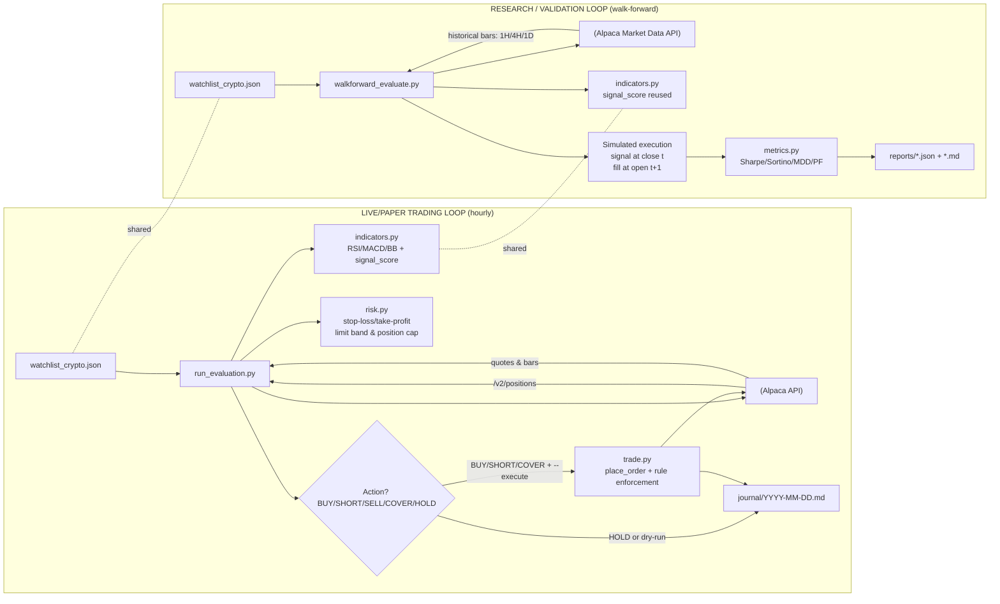

# Alpaca Crypto Trading Agent

A fully automated crypto trading agent running on Alpaca paper trading. The agent evaluates
10 crypto symbols every hour using a 6-point Signal Confluence strategy, places limit orders
when a score threshold is met, and journals every decision. A walk-forward backtester runs
daily to validate strategy robustness.

---

## Architecture



---

## Watchlist

Defined in `watchlist_crypto.json`. Crypto symbols use Alpaca's slash form (`BTC/USD`).
All 10 symbols trade 24/7 — the `/v2/clock` market-hours gate is **not** used.

| Symbol    | Symbol    |
|-----------|-----------|
| BTC/USD   | LTC/USD   |
| ETH/USD   | DOGE/USD  |
| SOL/USD   | ADA/USD   |
| AVAX/USD  | AAVE/USD  |
| LINK/USD  | DOT/USD   |

---

## Portfolio Caps (`portfolio_caps.json`)

Hard limits on position size as a fraction of total equity. Enforced at runtime by both
`run_evaluation.py` (sizing) and `trade.py` (final guard before order submission).

Keys use the canonical slash form (`BTC/USD`) to match the watchlist — no conversion needed.

| Symbol   | Max % equity |
|----------|-------------|
| BTC/USD  | 30%         |
| ETH/USD  | 15%         |
| ADA/USD  | 10%         |
| SOL/USD  | 10%         |
| DOGE/USD | 8%          |
| LTC/USD  | 6%          |
| DOT/USD  | 6%          |
| LINK/USD | 5%          |
| AVAX/USD | 5%          |
| AAVE/USD | 5%          |
| *(other)* | 5% (default) |

---

## Trading Strategy

The agent uses a **6-point Signal Confluence** scoring system applied to 15-min bars,
filtered by 4H trend and daily regime. Full strategy detail lives in
`skills/crypto-trader/SKILL.md`.

The agent's operating knowledge is split across five skills in `skills/` (2 knowledge
playbooks + 3 scheduled-routine procedures; the last two skills were added 2026-07-07):

| Skill | Role |
|-------|------|
| `crypto-trader/SKILL.md` | Execution playbook — scoring, Wyckoff, entries/exits, sizing |
| `crypto-catalysts/SKILL.md` | News & event interpretation — T1/T2/T3 catalyst severity ladder (hacks, depegs, unlocks, ETF flows, funding extremes, macro windows). Defensive only: news can veto/downsize entries or flag positions for close, never justify an entry below the score gates |
| `hourly-research-SKILL.md` | Top-of-hour research routine — per-symbol TA + news block appended to the daily journal (research-only, no orders) |
| `morning-brief-SKILL.md` | Daily 07:00 portfolio brief |
| `daily-journal-SKILL.md` | Daily 23:21 closing journal |

### Signal Confluence Table

| # | Indicator | Bullish | Bearish |
|---|-----------|---------|---------|
| 1 | EMA cross 20/50 (15-min) | Golden cross +1 | Death cross −1 |
| 2 | MACD histogram | Green and rising +1 | Red and falling −1 |
| 3 | RSI | 40–65 rising or <30 oversold +1 | >70 overbought −1 |
| 4 | Bollinger %b | Near lower band (<0.25) +1 | Near upper band (>0.75) −1 |
| 5 | Volume | ≥1.2× 20-bar avg +1 | <0.7× avg −0.5 |
| 6 | 4H trend | 20 EMA > 50 EMA on 4H +1 | 20 EMA < 50 EMA on 4H −1 |

**Long entry rules (loosened 2026-06-19):**
- uptrend/mixed, score ≥ 3.5 → BUY full size
- uptrend/mixed, score ≥ 2.5 (and < 3.5) → BUY half-size
- confirmed downtrend, score ≥ 4.0 → BUY half-size (counter-trend; `downtrend_long_score_threshold`)
- otherwise → HOLD

**Short entry rules (confirmed daily downtrend only):**
- score ≤ −4 → SHORT full size
- score = −3 → SHORT half-size (R:R ≥ 1:3)
- score > −3 → HOLD

**Exit rules:**
- Long: TA SELL when score ≤ −2; **swing-low stop** at the previous 4H range low (lowest low of the last 20 4H bars, clamped ≤8% below entry; −5% fallback when no 4H data)
- Short: COVER when score ≥ +2 (TA turning bullish); hard stop at +5% from entry (price rose)

All thresholds are configured in `config.json` — edit there, not in source files.

### Risk Rules (hard — cannot be overridden)

- **Limit orders only** — market orders are rejected by `trade.py`.
- **Limit band** — limit price must be within 0.2% of current ask for normal orders, 0.5% for stop-loss orders (`config.json > risk.limit_band_pct` / `stop_loss_limit_band_pct`).
- **Long stop-loss (4H swing low)** — TA-driven (set 2026-06-19): close immediately when price falls to/through the previous 4H range low — the lowest low of the last `risk.swing_low_lookback_bars` (20) completed 4H bars, less a small buffer, clamped to at most `risk.swing_low_max_stop_pct` (8%) below entry (`risk.stop_loss_mode = "swing_low_4h"`). Falls back to the fixed −5% (`risk.stop_loss_pct`) only when 4H history is unavailable.
- **Trailing stop** — activates at +2.5% profit, then trails 3% below the high-water mark (HWM). HWM is persisted in `data/positions_state.json` and survives evaluation cycles. Once active, the trailing stop supersedes the swing-low stop.
- **Stop-loss deduplication** — before placing any SELL/COVER stop order, `get_open_orders(symbol)` is called. If a pending order exists, re-sending is skipped. After `stop_loss_escalation_cycles` (2) unfilled cycles, the stale order is cancelled and replaced with a slightly wider limit (time-escalation via `stop_loss_limit_price(ask, cycles_open)`).
- **Short stop-loss** — cover immediately if a short position rises 5% from entry. Enforced by `risk.should_cover_short()`.
- **TA exit (long)** — SELL when Signal Confluence score drops to ≤ −2.
- **TA cover (short)** — COVER when Signal Confluence score rises to ≥ +2 (bullish flip).
- **Regime gate (long)** — in uptrend/mixed, BUY entries allowed at score ≥ 2.5 (half) / ≥ 3.5 (full). In a confirmed daily downtrend (last close < 50-day SMA and 20-day SMA < 50-day SMA), only a **half-size counter-trend long** at score ≥ 4.0 is allowed; otherwise longs are blocked.
- **Regime gate (short)** — SHORT entries only in a confirmed daily downtrend. No shorts in uptrend or mixed regime.
- **Correlation budget** — max open positions total and max per tier are **user-configurable** (defaults loosened 2026-06-19 to 4 total, 3 per tier; Tier-1: BTC/USD + ETH/USD; Tier-2: all other alts). New entries are blocked when either limit is hit. Python reads the caps from `config.json › risk.max_open_positions` / `max_positions_per_tier` (enforced by `risk.correlation_budget_allows()`); the dashboard Autopilot reads them from **Settings › 🔗 Correlation Budget**.
- **Daily drawdown gate** — if equity drops ≥ 3% vs. day-open equity, capital preservation mode activates: all new entries are blocked and existing stops tighten to 3%. State persists in `data/positions_state.json` and resets at midnight UTC.
- **ATR-based sizing** — `qty = (equity × 1%) / (ATR × 1.5)`, hard-capped by per-symbol cap in `config.json > portfolio_caps.caps`. Applied identically for long and short entries.
- **Partial take-profit + break-even ladder** *(2026-07-09)* — at +1R (R = entry − swing-low stop) sell `risk.partial_tp_fraction` (50%) and raise the remaining stop to breakeven; the remainder rides the trailing stop. Fires once per position (`partial_tp_done`/`breakeven_stop` in `data/positions_state.json`). **Bug #6 fix (2026-07-18):** the fill-history reconciliation that restores this flag after a lost state file (`reconcile_positions_from_fills()`) was misreading fee-rounded full-position closes (Alpaca SELL fills land ~0.1–0.25% short of the matching BUY qty) as partial scale-outs, so brand-new positions were pinning the stop to breakeven on their very first evaluation — causing fast, mostly-losing round trips. Fixed by comparing leftover lot qty to a tolerance relative to the lot's original size instead of a fixed epsilon; see `memory/memory.md`.
- **Stale-position exit** *(2026-07-09)* — positions older than `risk.max_hold_hours` (48) with an unarmed trailing stop and a live score below the half-size gate are sold at the normal limit band (winners exempt). Entry time tracked as `entry_time_iso`.
- **Position rotation** *(2026-07-09)* — at a full correlation budget, a blocked candidate scoring ≥ `strategy.rotation_min_score` (4.0) and ≥ `rotation_score_margin` (2.0) above the weakest open holding (which must score ≤ 0) replaces it in the same cycle. Config-flagged `strategy.rotation_enabled`; exits execute before entries.
- **Over-budget reconciliation** *(2026-07-09)* — a `BUDGET EXCEEDED n/m` journal warning fires whenever open positions exceed the budget; optional trim via `risk.enforce_budget_on_open_positions` (default false) sells the weakest overflow position. The dashboard Command tab mirrors this with a red chip.
- **Net R:R soft entry gate** *(2026-07-09)* — net R:R = (BB-upper target − entry − round-trip cost) ÷ (entry − swing-low stop), where round-trip cost = 2× `costs.taker_fee_bps_per_side` (25 bps) + live spread. Below `strategy.min_rr_half` (1.0) the entry is blocked; below `min_rr_full` (1.5) it is half-sized. Skipped when stop/target geometry is unavailable.
- **Session-edge filter** *(2026-07-09, experimental, OFF by default)* — with `strategy.session_filter_enabled=true`, entries are half-sized during GMT+2 hour/weekday buckets whose realized FIFO expectancy is negative over ≥ `session_min_sample` (20) round trips.
- **4H data fallback** *(2026-07-09)* — when the native 4H fetch returns < 51 bars, both engines aggregate 1H bars into synthetic 4H bars (complete 4-hour UTC buckets only); if that also fails, an explicit `DATA-QUALITY WARNING` is journaled and the dashboard Signals row shows a ⚠ marker instead of silently degrading Signal 6 and the swing-low stop.

---

## Scripts

| Script | Purpose |
|--------|---------|
| `scripts/run_evaluation.py` | Core evaluation loop — fetches bars, scores signals, decides BUY/SELL/HOLD, applies trailing stop + dedup + correlation budget + drawdown gate, places orders, writes journal. Bar fetch passes explicit `start`, `end = now − 1 period` (exclude in-progress bar) and `sort=desc` then reverses to chronological — without `sort=desc` Alpaca returns the *oldest* N bars of the window (daily bars were 54 d stale until 2026-06-11). `rebalance.py` and `research.py` reuse this fetcher. |
| `scripts/trade.py` | Single gateway for all orders — enforces limit-only, limit-band (wider for stop-loss), position-cap, and crypto 24/7 rules. Exposes `get_open_orders()`, `cancel_order()`, `get_order()`. |
| `scripts/indicators.py` | Pure-function TA library — EMA, SMA, RSI, MACD, Bollinger Bands, ATR, signal_score, plus informational ADX (trend strength) and OBV trend (volume flow) — journal-only, not scored |
| `scripts/risk.py` | Pure-function risk checks — position-cap, limit-band, stop-loss, trailing stop, correlation budget, daily drawdown gate, stop-loss limit-price helpers, plus (2026-07-09) trade economics (`spread_pct`, `round_trip_cost_pct`, `net_rr`), partial-TP (`should_partial_tp`), stale exit (`is_stale_position`), and rotation (`rotation_allows`) — all loaded from `config.json` |
| `scripts/position_state.py` | Persistent state manager — per-symbol HWM, entry time, partial-TP/breakeven state, stop order ID + cycle count; portfolio-level day-open equity, capital preservation mode. Atomic writes to `data/positions_state.json`. |
| `scripts/_api.py` | Shared HTTP helper — exponential-backoff retry (3 attempts, 5 s → 10 s → 20 s) for all Alpaca API calls |
| `scripts/walkforward_evaluate.py` | Walk-forward backtester — signal at bar close, fill at next open, supports 1H/4H/1D timeframes. `--fee-bps` defaults to 25/side (2026-07-09, from `config.json › costs`) so reports include realistic taker fees. |
| `scripts/metrics.py` | Performance metrics — Sharpe, Sortino, max drawdown, profit factor |
| `scripts/rebalance.py` | Portfolio rebalancer — trims over-cap positions and tops up under-cap ones using signal-confluence gate + ATR sizing; logs to journal |
| `scripts/scout.py` | Universe scout — auto-promotes uptrending score-≥4 `*/USD` pairs outside the watchlist into `data/watchlist_dynamic.json`; merged by `run_evaluation` when `scout.enabled` (default 5% cap + all gates apply) |
| `scripts/symbols.py` | Canonical symbol notation — single `to_slash()` converter (`BTCUSD → BTC/USD`, USDT/USDC/USD quotes, longest match first). The project-wide notation is the slash pair `BASE/QUOTE`; Alpaca's no-slash form exists only at the API boundary. Imported by `rebalance.py`, `run_evaluation.py`, `trade.py`, `scout.py`; mirrors the dashboard's `toSlash()`. |
| `scripts/verify.py` | Credential and connectivity verification |
| `scripts/_env.py` | Loads `.env` into `os.environ` at import time |

### Usage

```bash
# Dry-run (no orders placed)
python scripts/run_evaluation.py

# Execute mode (orders submitted to Alpaca)
python scripts/run_evaluation.py --execute

# Walk-forward backtest (BTC + ETH, 2024–2026, three timeframes)
python scripts/walkforward_evaluate.py \
  --symbols BTC/USD ETH/USD \
  --start 2024-01-01 --end 2026-05-01 \
  --train-days 90 --test-days 30 \
  --timeframes 1H 4H 1D \
  --fee-bps 5 --slippage-bps 5

# Quote / order / status via trade.py directly
python scripts/trade.py status
python scripts/trade.py quote BTC/USD
python scripts/trade.py order BTC/USD 0.001 buy 95000.00

# Rebalance portfolio to caps (dry-run)
python scripts/rebalance.py

# Rebalance and execute orders
python scripts/rebalance.py --execute

# Run the test suite
pytest tests/
```

---

## Tests

A pytest suite in `tests/` covers all pure-function modules without hitting the Alpaca API.

```
tests/
├── conftest.py          # sys.path setup + dummy env vars
├── test_indicators.py   # 52 tests — SMA, EMA, RSI, MACD, Bollinger, ATR, ADX, OBV, volume, signal_score
└── test_risk.py         # 34 tests — position cap, limit band, stop-loss, RiskCheck
```

Run with: `pytest tests/` (75 tests, ~0.25 s)

### Dashboard JS tests

Dashboard-only client-side logic (no Python equivalent) gets a standalone Node harness instead of pytest. `tests/test_socials_fetch.js` extracts the Socials tab's tweet-fetch functions straight from `docs/dashboard_professional.html` and runs them against mocked `fetch` responses (no network) — covers the Telegram-mirror success path, the retweet/media-only filters, the fake-"whitelisted" Nitter feed rejection, and the generalist-account crypto-keyword filter. Run with: `node tests/test_socials_fetch.js`.

### Python ↔ Dashboard consistency

`docs/dashboard_professional.html`'s `calcSignalScore()` must stay in parity with `scripts/indicators.py`'s `signal_score()`. After any indicator change, verify the 10-point checklist in `CLAUDE.md › Python ↔ Dashboard consistency check`. Key pitfalls caught in the 2026-05-26 audit:

- **MACD signal line NaN** — the 9-bar signal EMA must be seeded on the NaN-stripped MACD series (not the raw NaN-prefixed array). See `calcMACD()` comment.
- **Half-size pill thresholds** — use `score >= 3 && score < 4` (not `=== 3`) to catch scores like 3.5.

---

## GitHub Actions Automation

Two workflows in `.github/workflows/` drive fully autonomous operation.

### `trade.yml` — Trading Bot

| Trigger | Schedule | What runs |
|---------|----------|-----------|
| Cron | Every hour at **:00** | `run_evaluation.py --execute` (paper) |
| Cron | Daily at **23:00 UTC** | Daily journal summary |
| Manual dispatch | On demand | Configurable: `paper`/`live`, dry-run on/off |

Uses **GitHub Environments** (`paper` / `live`) — each environment holds two secrets:
- `APCA_API_KEY_ID` — Alpaca API key for that environment
- `APCA_SECRET_KEY` — Alpaca API secret for that environment

Configure under **Settings → Environments** in the GitHub repo. The `environment:` field on each job controls which set of secrets is injected; without it, environment secrets are never exposed.
- Journal changes are committed back to `main` after each run.

### `forward.yml` — Forward Analysis

| Trigger | Schedule | What runs |
|---------|----------|-----------|
| Cron | Daily at **08:11 UTC** | Walk-forward evaluation for BTC/USD + ETH/USD across 1H, 4H, 1D |
| Manual dispatch | On demand | Same |

- Always runs against the `paper` environment.
- Results (JSON + Markdown) are committed to `reports/`.

---

## Journal

One Markdown file per calendar day in `journal/YYYY-MM-DD.md`, following `journal/_template.md`.

The bot appends three types of block:

1. **`## Evaluation HH:MM GMT+2`** — written after every `:23` run (24× per day). Contains a one-line decision per symbol plus the full indicator breakdown for each.
2. **`## Research HH:MM GMT+2`** — market research block written on the hour.
3. **`## Daily Summary`** — written once at end of day (23:21 GMT+2).

Example journal block structure:
```
## Evaluation 14:23 GMT+2

- BTC/USD HOLD score=+2.0 ask=$97340.0000 (HOLD 0.0312 @ $95100.0000 (2.36%), score=2.0)
    score   : +2.0
    ema_x   : golden
    rsi     : 54.32
    macd    : line=120.4 sig=98.2 hist=22.2 (BULLISH FLIP)
    bb      : lower=96000 mid=97200 upper=98400 bw=0.0240 pb=0.56 trend=widening
    atr     : 320.0000  stop_1.5x=480.0000
    4h      : golden
    daily   : ma20=95000 ma50=90000 last=97340 regime=uptrend
    signals :
      ema_cross:    GOLDEN (20>50, +1)
      ...

### No orders submitted
```

---

## Walk-Forward Reports

Stored in `reports/` as paired `*.json` + `*.md` files, timestamped in UTC.

The backtester uses the same score thresholds as live trading (≥ 4 full size, = 3 half size),
loaded from `config.json`, so backtest results reflect actual strategy behaviour.

Latest report (`walkforward_20260514T103155Z`) summary — 23 windows, 2024-01-01 → 2026-05-01:

| Timeframe | Symbol    | Avg Sharpe | Median MDD |
|-----------|-----------|-----------|-----------|
| 1H        | BTC/USD   | +0.38     | −0.53%    |
| 1H        | ETH/USD   | −0.30     | −0.74%    |
| 4H        | BTC/USD   | −0.00     | −0.42%    |
| 4H        | ETH/USD   | −1.22     | −0.60%    |
| 1D        | BTC/USD   | +0.27     | −0.36%    |
| 1D        | ETH/USD   | −0.97     | −0.58%    |

---

## Dashboard

A self-contained HTML dashboard lives in `docs/`. Open either locally in a browser — no server required.

### `docs/dashboard_professional.html` *(primary)*

Professional trader decision cockpit in a **left sidebar navigation** (sticky 210px vertical column beside the content; collapses to a horizontal scroll bar on mobile ≤700px). The tabs are **grouped by job-to-be-done** under section headers — an *Act → Hold → Analyze* flow:

- **🧭 Command** (home / cockpit — Overview / 📰 News / 🐦 Socials sub-tabs)
- **⚡ Trade** — Signals · ⚡ Scalping (low-TF 5m/15m/1h confluence scanner + manual Buy/Sell) · 🌐 Market (Overview / Scanner / Breakout sub-tabs) · Execution
- **💼 Portfolio** — Overview · Allocation · Risk
- **📊 Analysis** — 🔬 Analytics (Performance / P&L / Edge sub-tabs) · 🧠 Insights · Backtest vs Live · Markov
- **⚙ Settings**

Three parent tabs nest sub-tabs via a shared sub-tab system: **🧭 Command** (Overview / 📰 News / 🐦 Socials — added 2026-07-09), **🌐 Market** (Overview / Scanner / Breakout) and **🔬 Analytics** (Performance / P&L / Edge). The active tab is stored in the URL hash (e.g. `dashboard_professional.html#signals`), so you can bookmark or link straight to any tab instead of always landing on Command, and a browser refresh restores the last tab you had open. (Driven by `switchTab()` writing the hash + `localStorage.lastTab`, and `applyTabFromUrl()` restoring it on load and on `hashchange`.) All parent tabs also route their sub-tabs through the hash (`#command-overview` / `#news` / `#socials`; `#market-overview` / `#market-signals` / `#gapgo`; `#performance` / `#pnl` / `#edge`), so those legacy deep links still open the right sub-tab.

Key features:
- **Live ticker strip** — top-of-page price bar driven by the **active watchlist** (Settings, up to 20 symbols) via `getWatchlist()`, not a static list. Fetches from Alpaca `/v1beta3/crypto/us/snapshots`, auto-refreshes every 15 seconds independently of the main dashboard, and re-renders immediately when the watchlist is edited (`saveWatchlistData` calls `loadTickerStrip`).
- **3-mode auto-refresh button** — cycles: `Auto OFF` → `Prices 15s` (ticker only) → `Full 60s` (ticker + full dashboard).
- **Hard Rules panel (live)** — Command tab shows all 6 hard rules with real-time portfolio status (cash %, daily loss, open risk, drawdown, stop-loss proximity, order type).
- **Cash Reserve rule** — Command Center checks cash ≥ 20% of equity (red if breached, yellow below 25%).
- **Latest Activity (Command tab)** — the 🚦 Trading Permission Rules panel shows the latest 2 FILL activities in its top-left corner (time GMT+2, side, qty, symbol, fill price), reusing the activity feed the dashboard already fetches.
- **Autopilot status mirror (Command tab)** — the last 3 Autopilot activity-log entries appear directly under the big trading-status word (`#tradingStatusLog`), kept in sync with the full Autopilot log.
- **🤖 Autopilot hardening (2026-07-08 roadmap)** — the in-dashboard Autopilot now mirrors the Python engine's protective machinery: a **daily-drawdown gate** (day-open equity snapshot per GMT+2 day in `localStorage.autopilotDayOpen`; equity ≥ 3% below day open → new entries blocked, exits stay active), **live snapshot quotes at order time** (entry/exit limit bands anchor to the live market instead of the last completed 15-min bar, which is up to ~15–30 min stale by design), a **stale-order lifecycle** (unfilled entry limits cancelled once open ≥ 4 hours of real wall-clock time — `STRAT_CFG.minStaleEntryAgeHours` / `risk.min_stale_entry_age_hours`, fixed 2026-07-13: previously gated on the `orderAge` cycle counter, which could cancel an entry after just 1 cycle (~15 min at the fastest interval) — **only the Autopilot's own orders**, identified by a `client_order_id` `ap-` tag so Python-engine and manual orders are never swept, bugfix 2026-07-08 v2; unfilled exit limits still cancel-replace after 2 cycles with a wider band — mirrors `stop_loss_escalation_cycles`; order ages tracked in `localStorage.autopilotOrderAge`), a **correlation-aware entry gate** (Pearson ρ > 0.9 on 30-day daily log-returns vs any open position → half-size), **scout promotions merged into the scan** (fresh `data/watchlist_dynamic.json` symbols, TTL-gated), and the **trailing-stop HWM seeded from `max(localStorage, data/positions_state.json)`** so the browser and Python loops can't trail from different highs. The trailing stop **arms from the HWM** (HWM ≥ 2.5% above entry) and keeps firing at HWM−3% even after P&L pulls back below the arm threshold — matching `risk.should_trail_stop_out` (bugfix 2026-07-08 v2). All strategy thresholds (TA exit, trailing arm/trail %, cash reserve %, swing-low stop params, min-bars, drawdown gate %, escalation) live in **`STRAT_CFG`**, seeded from `config.json › strategy/risk/data` on page load (`./config.json`, falling back to the project-root `../config.json`) — one config change updates both engines. The Command tab adds a **🔭 scout-promotions chip** and a **⚠ split-HWM warning** when both engines track a trailing HWM for the same symbol.
- **📰 News sub-tab (Command)** *(roadmap 2026-07-09, v2026-07-09.5)* — aggregated crypto headlines from 4 sources: the **Alpaca News API** (Benzinga, watchlist symbols, existing API keys) plus the **CoinDesk / Cointelegraph / Decrypt** RSS feeds via the keyless `rss2json.com` CORS bridge. Merged and **deduplicated by normalized headline + URL**, newest 40 kept, 5-min cache (↻ Refresh forces). Each headline gets a **T1/T2 catalyst badge** (T1 structural: hack / depeg / delisting / enforcement / chain halt; T2 flow: ETF flows / unlocks / listings / halving / Fed / CPI — per `skills/crypto-catalysts`) and base-ticker chips; an **⚡ Key only** filter shows just the T1/T2 items. Sources that fail (e.g. no API keys) are skipped gracefully and reported in the status line. News is a defensive input only — it never justifies an entry below the score gates.
- **🐦 Socials sub-tab (Command)** *(roadmap 2026-07-09, v2026-07-09.6; sources fixed 2026-07-10, v2026-07-10.1)* — crypto posts + stats from **14 curated accounts with > 0.5M followers** (Elon Musk, Binance, CZ, Coinbase, Vitalik Buterin, Michael Saylor, Justin Sun, Watcher.Guru, Whale Alert, Bitcoin Magazine, Cointelegraph, Pompliano, Voorhees, Novogratz). X/Twitter has no keyless API and blocks CORS, so the tab splits the job: **account stats are live** via the keyless **fxtwitter API** (`api.fxtwitter.com`, CORS-open — real follower and total-tweet counts; a `*` marks the static fallback snapshot when the call fails), while **post text** is fetched per account in reliability order through the keyless `rss2json.com` bridge: **the account's official Telegram mirror first** (via the public RSS-Bridge TelegramBridge on `t.me/s/<channel>` — Binance, Watcher.Guru, Whale Alert, and Cointelegraph have one; their posts are marked **TG** and link to Telegram), then **Nitter-mirror RSS as best-effort** (every public Nitter instance now bot-walls or user-agent-whitelists its RSS — the 2026-07-10 bugfix also rejects the fake *"RSS reader not yet whitelisted!"* error feed xcancel serves with HTTP 200, which previously rendered as tweets). Accounts with no reachable source show a red ✕ chip, stats stay live, and the tab never blanks. **Retweets and media-only Telegram posts are skipped**; generalist accounts (e.g. @elonmusk) are filtered to crypto-keyword posts only. Posts get the same **T1/T2 catalyst badges**, coin chips, and **⚡ Key only** filter as News; per-account stat chips show handle, live follower count, and posts fetched (with a tg/tw source suffix), and the status line totals reachable timelines, live-stat coverage, and combined reach in millions of followers. 10-min cache, ↻ Refresh forces. X links open the original post on x.com. Social flow is a defensive input only — it never justifies an entry below the score gates. **Bug investigation, 2026-07-13:** re-verified every public Nitter mirror (8 hosts from the status.d420.de tracker, plus X's own syndication API) — all are dead or CORS-locked to `platform.twitter.com`, confirming this is a platform limitation with no keyless client-side workaround, not a code bug. The 4 Telegram-mirrored accounts (Binance, Watcher.Guru, Whale Alert, Cointelegraph) remain the only sources that reliably deliver real posts; the dead-mirror fallback and feed-title guard are covered by a new offline unit test (`tests/test_socials_fetch.js`, run via `node tests/test_socials_fetch.js`) that exercises the exact production fetch/parse logic against mocked responses.
- **🤖 Autopilot controls always in sight** *(roadmap 2026-07-10 item 11 v2, v2026-07-10.3)* — the Autopilot controls (toggle, interval selector, ⛔ kill switch, status line) sit at the very top of the Command tab, **above the trading-permission indicator**; the Autopilot panel at the bottom of the page keeps the description and activity log.
- **🛑 5-minute stop watchdog** *(roadmap 2026-07-10 item 7)* — `scripts/stop_watchdog.py` runs every 5 minutes via GitHub Actions and checks only open-long exit levels (trailing stop from the persisted HWM, max(4H swing low, breakeven), fixed −5% fallback), firing the `trade.py` stop path. Skips symbols with a pending SELL; commits only when a stop fires.
- **🧪 Walk-forward baseline banner** *(roadmap 2026-07-10 item 8)* — the Backtest vs Live tab reads `reports/walkforward_latest.json` (stable pointer written by every walk-forward run, fees now 25 bps/side) and shows the baseline date + avg Sharpe per timeframe, turning red when the baseline is older than `walkforward.max_baseline_age_days` (45).
- **🎯 Execution tab — order Total column** *(roadmap 2026-07-09, v2026-07-09.4)* — the Recent Orders table shows each order's **total value in USD** (sortable, after Avg Fill): filled qty × avg fill price for (partially) filled orders, otherwise qty × limit price, falling back to the order's notional; "–" when no price is available.
- **🎯 Execution tab — order filters** *(roadmap, 2026-07-13)* — Symbol / Type / Side / Status filters above the Recent Orders table. Symbol, Type, and Status options populate dynamically from the orders actually loaded (`populateExecutionFilters()`); Side is a static Buy/Sell picker. Filtering is client-side against the cached order set (`applyExecutionFilters()` — no refetch) and shows a live "Showing X of Y orders" count; a Reset button clears all four filters back to "All".
- **Stop Distance column** — Positions table shows Stop $ and Target $ (direction-aware: longs use `entry × 0.95` / `entry × 1.10`; shorts use `entry × 1.05` / `entry × 0.90`), Live R:R, and a `SHORT` badge for short positions.
- **Portfolio Cap Usage column** — Risk table shows current allocation vs each symbol's cap from `config.json`.
- **Correlation heatmap** — Risk tab shows a 10×10 Pearson correlation matrix of daily log-returns across all watchlist symbols, in the left column of the "Portfolio Concentration & Correlation Risk" grid (Effective Exposure on the right). The matrix sizes to its content and is left-aligned (the `.corr-wrap table` overrides the global table min-width).
- **ATR Position Sizer** — built into the trade modal: enter equity, ATR, ask and cap% to get the 1%-risk-rule quantity, stop price and R:R.
- **🔬 Analytics tab** — Performance, P&L, and Edge are merged into one nav tab (in the **📊 Analysis** section) with a sub-tab bar. Performance auto-loads; P&L loads on select; Edge is manual (▶ Analyze). Sub-tabs are routed through the hash (`#performance` / `#pnl` / `#edge`), so those legacy deep links and a refresh keep working.
  - **📈 Performance sub-tab** — equity curve, rolling metrics, and a set of KPI tiles: **Total P&L** (FIFO realized P&L from fills — same number as the P&L sub-tab's "Total Realized P&L", `+$X.XX` / `-$X.XX` with colour), Total Return %, average return, annualised volatility, best/worst period. P&L tile is first and colour-coded green/red. Period selector: 1M / 3M / 6M / 1Y. (The old "Filled Orders" tile was removed 2026-06-17 — it duplicated the Execution tab.) The realized P&L is computed over the **full paginated FILL history** (`edgeFetchAllFills()`), not just the last 100 fills — fixed 2026-07-06, previously the total was truncated once the account exceeded 100 fills.
  - **💰 P&L sub-tab** — realized P&L from `/v2/account/activities` (full paginated FILL history via `edgeFetchAllFills()`) with FIFO matching, win rate, profit factor, calendar heatmap, P&L attribution by symbol, and day-of-week performance table.
  - **🔬 Edge sub-tab** — on-demand (▶ Analyze) realized-edge analytics: FIFO round-trips from all FILL activities — per-symbol expectancy table, P&L by hour-of-day / day-of-week (GMT+2), KPI tiles, and an auto-generated factual takeaway line.
- **📡 Signals tab** — live 6-point confluence scanner for the **Settings watchlist** symbols (reads `getWatchlist()` — the same list the user configures in the Settings tab). Rows are sorted descending by score. Uses paginated `next_page_token` fetching to ensure all symbols receive enough bars. Includes trend arrows (↑/↓/→ vs previous scan), ATR-based suggested quantity, regime-gated action pills (BUY/BUY½ in uptrend; SHORT/SHORT½ in downtrend), ⚡ quick-buy / ⚡ short buttons, and ▶ execute button for setups scoring ≥ 3 (long) or ≤ −3 (short). Since 2026-07-08: fresh **scout promotions** are scanned alongside the watchlist (blue **SCOUT** tag), **ADX(14) + OBV columns** show trend strength and volume flow (display-only informational indicators — not scored, same exemption as the Python journal lines), and an **R:R column** previews the implied reward:risk (4H swing-low stop vs BB-upper target; green at ≥ 1:2) — the same numbers appear in the trade modal when you open a ticket from this tab. **Scoring is identical to `scripts/indicators.py`** — EMA seeded with SMA, ±0.05% dead zone on EMA cross, MACD partial credits (+0.5/−0.5), RSI direction check (must be rising for +1 in 40–65 zone), minimum 60 bars before scoring (aligned with `data.min_bars_for_signal`, 2026-07-08).
- **🧪 Backtest vs Live tab** — compares live strategy metrics against your saved expected/backtest metrics (Sharpe, max drawdown, win rate, profit factor, avg daily return). Win Rate and Profit Factor are computed from **realized FIFO-matched fills** via the shared `computeFifoStats()` engine — the same numbers the P&L tab shows, so the two tabs can't diverge. (Previously these two metrics were broken: Win Rate compared fill vs limit price — always ~100% for limit orders — and Profit Factor was hardcoded `n/a`.) "Strategy Health" rolls all five metrics into a GREEN/ORANGE/RED status. **Sharpe and every other annualized KPI use a 365-day factor (crypto trades 24/7), matching `scripts/metrics.py` — corrected from the equity-market 252 on 2026-07-07.** An unmatched SELL (no prior BUY in the fill history) is no longer counted as a $0 "win" — it's excluded from win/loss stats and shown as "–" in the trade log (hardened 2026-07-07).
- **🌐 Market tab** — Market Overview, the confluence **Scanner**, and the Breakout Scanner are merged into one nav tab with a sub-tab bar. (The full-universe scanner sub-tab is labelled **🔭 Scanner**, renamed from "Signals" so that "Signals" names only the watchlist tab — the two are distinct: Signals is watchlist/execute, Scanner is the full-universe confluence scan.) Overview auto-loads (contextual/diagnostic); Scanner and Breakout stay manual (action-oriented — click ▶). The active sub-tab is mirrored to the URL hash + `localStorage.lastTab` so the legacy deep links `#market-overview` / `#market-signals` / `#gapgo` keep working and a refresh restores the exact sub-tab. Cross-links connect the sub-tabs ("View scanner →" on Overview, "← Back to market context" on Scanner and Breakout), and selection state persists when you switch because all sub-pages keep their rendered tables.
  - **🌍 Market Overview sub-tab** — live price, 24h%, 7d%, USD volume, trend direction, and market cap tier per crypto symbol. The symbol set is the shared tradable-crypto universe (`getCryptoUniverse()`) **filtered to `/USD` pairs** (`usdPairsOnly()`, bugfix 2026-07-09 v2 — Alpaca trades against USD, and the mixed USDT/USDC quotes duplicated each base up to 3×) and sliced by the same **Settings → Signals Analysis → Max Symbols** value as Market Signals, so it is no longer hardcoded to 30 — raise Max Symbols to show more rows. The symbol cell shows the full pair (e.g. `BTC/USD`). Every symbol gets a real, contiguous rank number — the known top-30 use their market-cap rank, and the rest are numbered by their position in the universe (via the `symbolInfo()` helper) instead of showing `?`. Symbols beyond the top-30 still show tier `?`. Sortable by rank, 24h%, 7d%, or signal score. Includes a color-coded momentum heatmap. The Score column auto-fills from the most recent Market Signals scan. Snapshots are fetched in batches via `fetchSnapshotsInBatches` so one unsupported symbol can never blank out the whole table. `1INCH/USD` (invalid Alpaca symbol — starts with a digit) replaced with `MATIC/USD`. The symbol/name cell is wrapped in its own `<td>` (a previously missing opening tag let the symbol overflow onto the next row, away from the Rank column). Each row has a **Trade** column with **Buy / Sell** buttons (`moTradeButtons()`) that open the shared paper-trade ticket pre-filled with the symbol, side, and live price (quantity left blank for you to size); they show `–` when no live price is available.
  - **🔭 Scanner sub-tab** — on-demand full 6-point confluence scanner across the full tradable-crypto universe (formerly labelled "Market Signals"). A per-symbol **Watchlist** column lets you act on a scan result directly: a **+ Watch** button appears when the score is at or above the buy gate (≥ 4) and the symbol is not already on your watchlist, and a **– Unwatch** button appears when the signal is a sell (score ≤ −2) and there is no open position for that symbol. The buttons update the shared Settings watchlist (and the Settings tag editor) and re-render in place without re-running the scan; open positions are read from `/v2/positions` to gate the remove button. The number of symbols scanned is set by the **Settings → Signals Analysis → Max Symbols** value (`maxSignalSymbols`, default 30, **no upper limit**); the scanner takes the top-N from `getCryptoUniverse()` **filtered to `/USD` pairs** (`usdPairsOnly(universe).slice(0, n)`, bugfix 2026-07-09 v2 — Alpaca trades against USD, and the USDT/USDC-quoted duplicates made the same base appear up to 3× per scan; those pairs now live only in the Settings watchlist selector). The universe itself is the full list of tradable crypto pairs quoted in USD, USDT, or USDC from Alpaca's assets endpoint (shared with the Market Overview tab; robust to both `BTC/USD` and bare `BTCUSD` symbol formats; stablecoin *base* pairs such as `USDT/USD` and `USDC/USD` are still excluded). Symbol cells show the full pair (e.g. `BTC/USD`) — the market-cap-ranked top 30 first, then every other accepted pair alphabetically (falls back to the static 30 if the assets call fails — but this fallback is **not** cached, so a failed first call retries instead of leaving the universe stuck at 30; fixed 2026-06-18). Entering a value above 30 now genuinely scans more than 30 symbols, capped only by how many pairs your account can trade. The universe is still finite, so a Max Symbols value above the number of tradable `/USD` pairs can't be reached — when it exceeds the available universe, the scan button shows `▶ Scan Top <N> (all available)` and the scan status notes that the setting exceeds the tradable-pair count (Market Overview shows the same note). The scan button label is otherwise dynamic (`▶ Scan Top N`) so the active count is always visible and updates the moment you save the setting. Reuses the same `calcSignalScore` / `fetchBars` logic as the watchlist Signals tab. The **📊 Score Distribution** tile uses the shared `renderScoreDist()` helper, so it renders identically to the Signals tab (bucketed BUY / HALF / HOLD / BEAR horizontal bars) instead of a per-integer inline list. Also shows a Top Opportunities panel listing current BUY setups outside the watchlist. Scores are cached and displayed in the Market Overview tab's Score column.
  - **📊 Breakout sub-tab** — on-demand pre-session breakout/gap analysis for all 10 watchlist symbols (formerly a standalone tab, folded into Market): catalyst rating, market cap / supply risk, gap-and-go likelihood, 6-month range position, key S/R levels (swing highs/lows are date-stamped — e.g. "Swing Low · 21 Jun" — so multiple swing levels are distinguishable; bug fix 2026-07-11), historical gap behaviour, trade plan (strategy, entry, stop, T1, T2), and risk rating. Computed client-side from 6 months of daily bars + 8 days of hourly bars. Symbols ranked by conviction score. Each card header shows two scores: **Conviction** (gap/breakout-specific, max ±7) and **Signal** (the standard 6-point `calcSignalScore()` score — identical to the Signals and Market Signals tabs). Manual run (▶ Run Analysis); deep link `#gapgo` preserved.
- **🔗 Markov tab** — on-demand first-order Markov chain analysis for `BTC/USD` and `ETH/USD` over 30/60/90/180/365-day lookback windows. Each daily close-to-close return is classified into one of three states using a ±1% band (Up / Flat / Down). For each symbol × interval it renders a 3×3 transition matrix (heatmap-shaded `P(next | current)`), the stationary distribution (power iteration), a one-step-ahead next-day forecast from the current state, and the mean daily return. KPI tiles surface each symbol's 90-day next-day-up probability. One daily-bar fetch per symbol (`fetchBars(..., "1Day", 370)`) covers all five windows; windows with < 3 transitions show "Insufficient data". User-triggered via **▶ Run Markov Analysis**. Matrix tables use a dedicated `.mk-matrix` class (`min-width:0; table-layout:fixed`) so they fit inside the narrow grid panels instead of inheriting the global 760px table min-width (which made the matrices overflow and overlap).
- **🧠 Insights tab** — on-demand (▶ Analyze) **behavioral / trading-psychology** analysis built from your realized FIFO round-trips (`insRoundTrips()` over the full paginated FILL history). Four plain-language cards answer "am I trading *well*", not just "how much did I make": **🗓 Day-of-Week Edge** (per-weekday win rate + net P&L in GMT+2, flags your worst losing weekday), **📉 After Losing Streaks** (win rate after 1 loss and after 2+ consecutive losses vs your baseline — flags whether you tilt after losses), **🔁 Cadence After Outcome** (median time to your next trade after a win vs after a loss — flags overtrading after wins), and **⚠ Rule Discipline** (best-effort rule-break detection from trade history: −5% hard-stop breaches and per-symbol cap breaches). Three KPI tiles summarise rule breaches, after-2-loss win rate, and worst weekday. Analysis-only — places no orders. Rule-break detection is approximate (it uses *current* equity for cap checks since historical equity isn't in the fills feed).
- **📓 Daily Journal button** — top-row header button (`generateDailyJournal()`) that produces today's closing journal entry from live data: a Summary block (close equity, day P&L vs day-open, cash %, open-position count + unrealized P&L, trades-executed-today + session realized P&L via FIFO), a Trades Today table (FILL activities filtered to the GMT+2 calendar day), an Open Positions table, and a templated Market Observations paragraph backed by a closing 10-symbol confluence scan. Opens a preview modal with **📋 Copy** and **↓ Download .md** (filename `daily-journal-YYYY-MM-DD.md`). No backend required.
- **⚙ Settings tab** — grouped into labelled sections: **📄 Paper Trading** (API Key + Secret), **🔴 Live Trading** (API Key + Secret), **🛡 Risk Limits** (Assumed Stop Loss %, Max Daily Loss %, Max Open Risk %), **🔭 Signals Analysis** (Max Symbols, default 30, no upper clamp), **🔗 Correlation Budget (Autopilot)** (Max Open Positions total + Max Positions Per Tier, defaults 4 / 3, min 1 — the Autopilot reads these live each cycle), and **📋 Active Watchlist** (tag editor — add/remove/reset up to 20 symbols; the add-symbol control is a dropdown of the full tradable Alpaca exchange universe via `<input list>` + `<datalist>` — pick from the list or type to filter, already-added symbols excluded; the universe now includes pairs quoted in **USD, USDT, and USDC** (e.g. BTC/USDT, ETH/USDC), not just USD — **selector-only since the 2026-07-09 v2 bugfix**: the Scanner and Market Overview filter their scan universe to `/USD` pairs (Alpaca trades against USD); a **Show stablecoins** checkbox (default off) additionally opts stablecoin-*base* USD pairs like USDT/USD into the dropdown — selector-only, scans stay stablecoin-base-free; stored in `localStorage.proDashboardWatchlist`; used by Autopilot, Daily Journal, Signals tab, and all Portfolio tabs). Settings persist to `localStorage` (no save-to-file); `config.json` seeds only a fresh browser with no saved state.

### Portfolio tabs (integrated into `docs/dashboard_professional.html`)

As of 2026-06-15, the portfolio dashboard pages were merged into the Professional Dashboard as new nav tabs under a **"💼 Portfolio"** section label in the sidebar. The legacy `docs/portfolio-dashboard.html` file was deleted on 2026-06-17 — the Professional Dashboard is the sole entry point.

- **📊 Portfolio Overview** (`port-overview`) — Account equity/cash/buying-power/P&L cards (tiles laid out horizontally in a responsive `.cards` grid that wraps), equity curve (Chart.js, period selector: 1D/1W/1M/3M/1Y), sortable open positions table (short-aware; column-header sorting powered by `applySort()`/`numOrStr()` helpers).
- **🥧 Allocation** (`port-dist`) — Donut allocation chart with legend, breakdown table, cap utilisation table (all watchlist symbols vs. `PORTFOLIO_CAPS` limits, Over Cap / Near Cap / OK status badges). The "⚠ Over Cap" badge fires only when the rounded utilisation actually exceeds 100%, so it always matches the displayed "% of cap used" (a position exactly at cap reads "100% of cap used" / Near Cap, never a false Over Cap); the progress bar is clamped to 100%.

---

## Configuration

### `config.json` — Strategy Parameters

Central configuration for all tunable numbers. **Edit here, not in source files.**
Scripts load this at startup; no restart needed between runs.

```json
{
  "strategy": {
    "buy_score_threshold": 4.0,
    "buy_score_half_size_threshold": 3.0,
    "sell_score_threshold": -2.0,
    "short_score_threshold": -4.0,
    "short_score_half_size_threshold": -3.0,
    "cover_score_threshold": 2.0,
    "atr_multiplier": 1.5,
    "risk_per_trade_pct": 0.01,
    "rotation_enabled": true,
    "rotation_min_score": 4.0,
    "rotation_score_margin": 2.0,
    "min_rr_full": 1.5,
    "min_rr_half": 1.0,
    "session_filter_enabled": false,
    "session_min_sample": 20
  },
  "costs": {
    "taker_fee_bps_per_side": 25
  },
  "risk": {
    "stop_loss_pct": 0.05,
    "limit_band_pct": 0.002,
    "stop_loss_limit_band_pct": 0.005,
    "default_position_cap_pct": 0.05,
    "trailing_stop_activation_pct": 0.025,
    "trailing_stop_trail_pct": 0.03,
    "stop_loss_escalation_cycles": 2,
    "stop_loss_escalation_extra_pct": 0.003,
    "max_open_positions": 3,
    "tier1_symbols": ["BTC/USD", "ETH/USD"],
    "max_positions_per_tier": 2,
    "daily_drawdown_gate_pct": 0.03,
    "capital_preservation_stop_pct": 0.03,
    "enforce_budget_on_open_positions": false,
    "max_hold_hours": 48,
    "partial_tp_enabled": true,
    "partial_tp_r_multiple": 1.0,
    "partial_tp_fraction": 0.5
  },
  "indicators": {
    "ema_fast": 20, "ema_slow": 50,
    "rsi_period": 14,
    "macd_fast": 12, "macd_slow": 26, "macd_signal": 9,
    "bollinger_period": 20, "bollinger_std": 2.0
  },
  "api": {
    "max_retry_attempts": 3,
    "retry_backoff_seconds": 5.0
  }
}
```

After changing indicator periods, re-run the walk-forward backtest to validate.

### Environment Variables (`.env`)

```
APCA_API_KEY_ID=<your key>
APCA_API_SECRET_KEY=<your secret>
APCA_BASE_URL=https://paper-api.alpaca.markets   # or https://api.alpaca.markets for live
```

### Claude Agent Settings (`.claude/settings.local.json`)

Grants the agent permission to stage files for git commits:
```json
{
  "permissions": {
    "allow": ["Bash(git add *)", "Bash(git rm *)"]
  }
}
```

---

## Market Researcher Agent

`.claude/agents/market-researcher.md` defines an analysis-only subagent acting as a
professional crypto spot trader. It (1) verifies strategy assumptions, risks, and
profitability against current Alpaca spot-market conditions, and (2) reviews the project
after every strategy change (rule consistency Python ↔ dashboard ↔ docs, hard-rule
soundness, walk-forward evidence, test suite). Each run logs a timestamped Markdown
report to `data/market_research/` (GMT+2) with a PASS / PASS WITH WARNINGS / FAIL
verdict. It never places, cancels, or modifies orders.

---

## Repository Structure

```
alpaca-trading-agent/
├── .claude/
│   ├── agents/
│   │   └── market-researcher.md  # Research-desk subagent (analysis only, no trading)
│   ├── routines.json          # Cowork agent routine definitions
│   └── settings.local.json    # Agent permission grants
├── .github/workflows/
│   ├── trade.yml              # Hourly trading + daily summary
│   └── forward.yml            # Daily walk-forward analysis
├── docs/
│   ├── dashboard_professional.html     # Professional dashboard (sole entry point; includes the portfolio tabs)
│   └── dashboard_layout.md            # Dashboard layout & changelog (Professional + Portfolio sections)
├── journal/
│   ├── _template.md           # Journal entry template
│   └── YYYY-MM-DD.md          # One file per calendar day
├── memory/
│   ├── glossary.md            # Domain glossary
│   └── projects/
│       └── alpaca-trading-agent.md
├── reports/
│   └── walkforward_*.json/md  # Walk-forward backtest results
├── data/
│   ├── market_research/       # Timestamped market-researcher agent reports
│   ├── watchlist_dynamic.json # Scout-promoted symbols (auto-generated, TTL-refreshed)
│   └── positions_state.json   # Persistent per-position state (HWM, stop order IDs, drawdown gate)
├── scripts/
│   ├── _api.py                # HTTP retry helper (exponential backoff)
│   ├── _env.py                # .env loader
│   ├── indicators.py          # Pure-function TA (EMA/RSI/MACD/BB/ATR + informational ADX/OBV)
│   ├── metrics.py             # Performance metrics (Sharpe/MDD/PF)
│   ├── position_state.py      # Persistent state manager (HWM, stop order dedup, drawdown gate)
│   ├── rebalance.py           # Portfolio rebalancer (trim over-cap, top-up under-cap)
│   ├── research.py            # Market research helper
│   ├── risk.py                # Risk rule enforcement (reads config.json)
│   ├── run_evaluation.py      # Main evaluation + order placement
│   ├── symbols.py             # Canonical symbol notation (to_slash: BTCUSD → BTC/USD)
│   ├── trade.py               # Alpaca order gateway (retry via _api.py)
│   ├── verify.py              # Credential/connectivity check
│   └── walkforward_evaluate.py # Walk-forward backtester
├── skills/
│   ├── crypto-trader/
│   │   └── SKILL.md           # Full trading strategy playbook
│   ├── crypto-catalysts/
│   │   └── SKILL.md           # News & event interpretation (T1/T2/T3 catalyst ladder)
│   ├── hourly-research-SKILL.md # Top-of-hour research routine (research-only)
│   ├── morning-brief-SKILL.md   # Daily 07:00 brief routine
│   └── daily-journal-SKILL.md   # Daily 23:21 closing journal routine
├── tests/
│   ├── conftest.py            # pytest setup (sys.path + dummy env vars)
│   ├── test_indicators.py     # 52 indicator unit tests
│   ├── test_risk.py           # 34 risk rule unit tests
│   └── test_socials_fetch.js  # Node harness — Socials tab tweet-fetch logic (no pytest equivalent)
├── .env                       # API credentials (git-ignored)
├── .gitignore
├── CLAUDE.md                  # Agent operating instructions
├── config.json                # Central strategy + risk configuration
├── portfolio_caps.json        # Per-symbol position caps (BTC/USD slash form)
├── requirements.txt           # Python dependencies
└── watchlist_crypto.json      # Symbols to trade
```

---

## Roadmap

**Roadmap empty — the famous-trader package shipped (2026-07-10, v2026-07-10.3).** All 10 audit items are implemented: **pyramiding into winners** in strong 4H trends (Livermore/Turtle 2N adds — +1R/+2R tranches at half risk, stop to breakeven after each add, mutually exclusive per position with the partial-TP ladder by ADX 25), a **Chandelier ATR-adaptive trailing stop** (`risk.trail_mode`), **conviction-scaled sizing** (0.75×/1.0×/1.5× risk by score band), a **losing-streak/drawdown throttle** (PTJ — 3 straight losses or a 5% 7-day drawdown halve risk-per-trade until 2 winners + recovery below 2.5%; state persists), a **measured-move trend target** feeding the net-R:R gate, **maker-first entry pricing** (rest entries at the bid, 1-cycle repricing timeout, taker exits; `check_limit_band` now accepts limits inside the live spread), a **5-minute stop-loss watchdog** (`scripts/stop_watchdog.py` + `watchdog.yml` — exits only, dedup against pending SELLs, commits only when a stop fires), the **walk-forward re-baseline machinery** (workflow fees corrected 5→25 bps/side; `reports/walkforward_latest.json` stable pointer; dashboard Backtest-tab staleness banner at 45 days), the **session-edge filter enabled** (self-guarding on its 20-round-trip minimum sample per bucket), and a **portfolio breadth/regime gate** (Weinstein — ≤30% uptrend breadth restricts new entries to Tier-1 with a halved budget). Entry-affecting features ship **config-flagged OFF** pending walk-forward validation (`pyramid_enabled`, `trail_mode`, `conviction_sizing_enabled`, `measured_move_enabled`, `breadth_gate_enabled`, `maker_first_entries`); the throttle, watchdog, session filter, and baseline machinery are active. 27 new tests (168 total). See `memory/memory.md`.

**All 5 audit bugs fixed (2026-07-10, v2026-07-10.2):** (1 — P0) `data/positions_state.json` is now committed by the trading workflow on every run, and the +1R partial-take-profit flag, breakeven stop, and entry clock are **reconciled from Alpaca's own fill history** (`reconcile_positions_from_fills()` in `run_evaluation.py`), so a lost state file can never re-fire the partial TP again (the AAVE 6×-re-fire failure mode); (2) `get_crypto_bars` now follows `next_page_token` — Alpaca caps a single response at ~7 days of bars (verified live: 4Hour `limit=120` returned 43), which had zeroed Signal 6 and degraded swing-low stops to the fixed −5%; after the fix 4H fetches return the full 120 bars; (3) a non-positive `avg_entry_price` from the API (the `SOL/USD @ $-4.4931` corruption) is replaced with the FIFO-derived cost basis of the still-open lots; (4) the evaluation cron is **hourly at :23** (was every 4 hours), each run journals a `CADENCE WARNING` if the previous evaluation is > 90 minutes old, and the 23:21 job now writes a real closing summary via the new `scripts/daily_summary.py` (equity, day change, positions, fills, FIFO realized P&L for the day) instead of a second evaluation; (5) the correlation budget is aligned at **7 total / 5 per tier** (15 was unreachable with only 2 Tier-1 symbols) across `config.json`, the dashboard `DEFAULT_LIMITS`, and the CLAUDE.md hard-rules table. Roadmap item 11 (Autopilot controls above the permission panel) shipped in the same version. 11 new regression tests (141 total). See `memory/memory.md`.

Latest shipped fix before that (2026-07-10, v2026-07-10.1): the **Socials sub-tab RSS bug** ("RSS reader not yet whitelisted!") — xcancel serves that error as a fake HTTP-200 feed which rendered as tweets, and every public Nitter mirror now blocks keyless RSS readers. `socFetchAccount()` now validates the feed title against the account handle and fetches each account's **official Telegram mirror first** (RSS-Bridge TelegramBridge → rss2json; Binance, Watcher.Guru, Whale Alert, Cointelegraph), keeping Nitter as best-effort fallback. See `memory/memory.md`.

Earlier: the **Command › 🐦 Socials sub-tab** was implemented on 2026-07-09 (v2026-07-09.6): crypto tweets + stats from 14 curated >0.5M-follower accounts via Nitter-mirror RSS through rss2json, with T1/T2 catalyst badges, per-account stat chips, and an ⚡ Key-only filter. (The Command › 📰 News sub-tab shipped earlier the same day in v2026-07-09.5.) See the dashboard feature list above and `memory/memory.md`.

Earlier: the **symbol-notation consistency item** was implemented on 2026-07-09 (v2026-07-09.3): the canonical project-wide notation is the slash pair `BASE/QUOTE` (e.g. `BTC/USD`), with Alpaca's no-slash form confined to the API boundary. New shared converter `scripts/symbols.py › to_slash()` replaced four duplicated local implementations; the dashboard's remaining bare-base display labels (scout chip, ticker strip, Market Overview KPIs/heatmap/tooltips) now show the full pair. See CLAUDE.md › "Symbol notation (canonical)" and `memory/memory.md`.

Earlier: all eight candidates from the **2026-07-09 trader-effectiveness analysis** were implemented on 2026-07-09 (v2026-07-09.1): fee- & spread-aware trade economics (Spread columns, net-of-cost R:R, scalp viability gate, walk-forward fee default 25 bps/side), position rotation at the correlation budget, over-budget reconciliation + Command-tab chip, partial take-profit at +1R with a break-even ladder, time-based stale-position exit, a 4H data fallback via 1H-bar aggregation, a net-R:R soft entry gate, and a session-edge feedback filter (ships OFF). Implementation notes are in `memory/memory.md` (2026-07-09 entry).

---

## Dependencies

See `requirements.txt`. Core packages: `requests`, `numpy`, `pandas`.
Dev dependency: `pytest` (for running the test suite).
Python 3.11 is used in CI; 3.10+ works locally.

---

## Paper vs Live Trading

The workflow supports both environments via the `environment` input on manual dispatch.
Paper trading is the default for all scheduled runs. Live trading requires separate
GitHub secrets (`APCA_LIVE_KEY_ID` / `APCA_LIVE_SECRET_KEY`) and an explicit manual trigger.

> **Note:** This is a paper trading agent for research purposes. Past backtest performance
> does not guarantee future results.