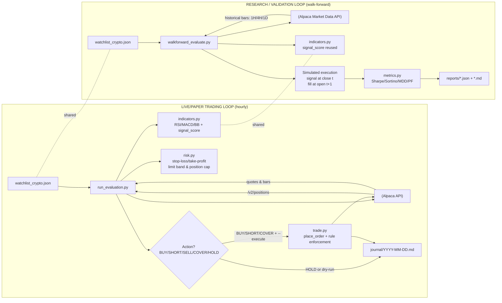

# Alpaca Crypto Trading Agent

A fully automated crypto trading agent running on Alpaca paper trading. The agent evaluates
10 crypto symbols every hour using a 6-point Signal Confluence strategy, places limit orders
when a score threshold is met, and journals every decision. A walk-forward backtester runs
daily to validate strategy robustness.

---

## Architecture



---

## Watchlist

Defined in `watchlist_crypto.json`. Crypto symbols use Alpaca's slash form (`BTC/USD`).
All 10 symbols trade 24/7 — the `/v2/clock` market-hours gate is **not** used.

| Symbol    | Symbol    |
|-----------|-----------|
| BTC/USD   | LTC/USD   |
| ETH/USD   | DOGE/USD  |
| SOL/USD   | ADA/USD   |
| AVAX/USD  | AAVE/USD  |
| LINK/USD  | DOT/USD   |

---

## Portfolio Caps (`portfolio_caps.json`)

Hard limits on position size as a fraction of total equity. Enforced at runtime by both
`run_evaluation.py` (sizing) and `trade.py` (final guard before order submission).

Keys use the canonical slash form (`BTC/USD`) to match the watchlist — no conversion needed.

| Symbol   | Max % equity |
|----------|-------------|
| BTC/USD  | 30%         |
| ETH/USD  | 15%         |
| ADA/USD  | 10%         |
| SOL/USD  | 10%         |
| DOGE/USD | 8%          |
| LTC/USD  | 6%          |
| DOT/USD  | 6%          |
| LINK/USD | 5%          |
| AVAX/USD | 5%          |
| AAVE/USD | 5%          |
| *(other)* | 5% (default) |

---

## Trading Strategy

The agent uses a **6-point Signal Confluence** scoring system applied to 15-min bars,
filtered by 4H trend and daily regime. Full strategy detail lives in
`skills/crypto-trader/SKILL.md`.

### Signal Confluence Table

| # | Indicator | Bullish | Bearish |
|---|-----------|---------|---------|
| 1 | EMA cross 20/50 (15-min) | Golden cross +1 | Death cross −1 |
| 2 | MACD histogram | Green and rising +1 | Red and falling −1 |
| 3 | RSI | 40–65 rising or <30 oversold +1 | >70 overbought −1 |
| 4 | Bollinger %b | Near lower band (<0.25) +1 | Near upper band (>0.75) −1 |
| 5 | Volume | ≥1.2× 20-bar avg +1 | <0.7× avg −0.5 |
| 6 | 4H trend | 20 EMA > 50 EMA on 4H +1 | 20 EMA < 50 EMA on 4H −1 |

**Long entry rules (uptrend or mixed regime):**
- score ≥ 4 → BUY full size
- score = 3 → BUY half-size (R:R ≥ 1:3)
- score ≤ 2 → HOLD

**Short entry rules (confirmed daily downtrend only):**
- score ≤ −4 → SHORT full size
- score = −3 → SHORT half-size (R:R ≥ 1:3)
- score > −3 → HOLD

**Exit rules:**
- Long: TA SELL when score ≤ −2; hard stop at −5% from entry
- Short: COVER when score ≥ +2 (TA turning bullish); hard stop at +5% from entry (price rose)

All thresholds are configured in `config.json` — edit there, not in source files.

### Risk Rules (hard — cannot be overridden)

- **Limit orders only** — market orders are rejected by `trade.py`.
- **Limit band** — limit price must be within 0.2% of current ask for normal orders, 0.5% for stop-loss orders (`config.json > risk.limit_band_pct` / `stop_loss_limit_band_pct`).
- **Long stop-loss** — close immediately if a long position drops 5% from entry (`config.json > risk.stop_loss_pct`).
- **Trailing stop** — activates at +2.5% profit, then trails 3% below the high-water mark (HWM). HWM is persisted in `data/positions_state.json` and survives evaluation cycles. Once active, the trailing stop supersedes the hard 5% stop.
- **Stop-loss deduplication** — before placing any SELL/COVER stop order, `get_open_orders(symbol)` is called. If a pending order exists, re-sending is skipped. After `stop_loss_escalation_cycles` (2) unfilled cycles, the stale order is cancelled and replaced with a slightly wider limit (time-escalation via `stop_loss_limit_price(ask, cycles_open)`).
- **Short stop-loss** — cover immediately if a short position rises 5% from entry. Enforced by `risk.should_cover_short()`.
- **TA exit (long)** — SELL when Signal Confluence score drops to ≤ −2.
- **TA cover (short)** — COVER when Signal Confluence score rises to ≥ +2 (bullish flip).
- **Regime gate (long)** — no new BUY entries in a confirmed daily downtrend (last close < 50-day SMA and 20-day SMA < 50-day SMA).
- **Regime gate (short)** — SHORT entries only in a confirmed daily downtrend. No shorts in uptrend or mixed regime.
- **Correlation budget** — max 3 open positions total; max 2 per tier (Tier-1: BTC/USD + ETH/USD; Tier-2: all other alts). New entries are blocked when either limit is hit. Enforced by `risk.correlation_budget_allows()`.
- **Daily drawdown gate** — if equity drops ≥ 3% vs. day-open equity, capital preservation mode activates: all new entries are blocked and existing stops tighten to 3%. State persists in `data/positions_state.json` and resets at midnight UTC.
- **ATR-based sizing** — `qty = (equity × 1%) / (ATR × 1.5)`, hard-capped by per-symbol cap in `config.json > portfolio_caps.caps`. Applied identically for long and short entries.

---

## Scripts

| Script | Purpose |
|--------|---------|
| `scripts/run_evaluation.py` | Core evaluation loop — fetches bars, scores signals, decides BUY/SELL/HOLD, applies trailing stop + dedup + correlation budget + drawdown gate, places orders, writes journal. Bar fetch passes explicit `start`, `end = now − 1 period` (exclude in-progress bar) and `sort=desc` then reverses to chronological — without `sort=desc` Alpaca returns the *oldest* N bars of the window (daily bars were 54 d stale until 2026-06-11). `rebalance.py` and `research.py` reuse this fetcher. |
| `scripts/trade.py` | Single gateway for all orders — enforces limit-only, limit-band (wider for stop-loss), position-cap, and crypto 24/7 rules. Exposes `get_open_orders()`, `cancel_order()`, `get_order()`. |
| `scripts/indicators.py` | Pure-function TA library — EMA, SMA, RSI, MACD, Bollinger Bands, ATR, signal_score |
| `scripts/risk.py` | Pure-function risk checks — position-cap, limit-band, stop-loss, trailing stop, correlation budget, daily drawdown gate, stop-loss limit-price helpers (all loaded from `config.json`) |
| `scripts/position_state.py` | Persistent state manager — per-symbol HWM, stop order ID + cycle count; portfolio-level day-open equity, capital preservation mode. Atomic writes to `data/positions_state.json`. |
| `scripts/_api.py` | Shared HTTP helper — exponential-backoff retry (3 attempts, 5 s → 10 s → 20 s) for all Alpaca API calls |
| `scripts/walkforward_evaluate.py` | Walk-forward backtester — signal at bar close, fill at next open, supports 1H/4H/1D timeframes |
| `scripts/metrics.py` | Performance metrics — Sharpe, Sortino, max drawdown, profit factor |
| `scripts/rebalance.py` | Portfolio rebalancer — trims over-cap positions and tops up under-cap ones using signal-confluence gate + ATR sizing; logs to journal |
| `scripts/scout.py` | Universe scout — auto-promotes uptrending score-≥4 `*/USD` pairs outside the watchlist into `data/watchlist_dynamic.json`; merged by `run_evaluation` when `scout.enabled` (default 5% cap + all gates apply) |
| `scripts/verify.py` | Credential and connectivity verification |
| `scripts/_env.py` | Loads `.env` into `os.environ` at import time |

### Usage

```bash
# Dry-run (no orders placed)
python scripts/run_evaluation.py

# Execute mode (orders submitted to Alpaca)
python scripts/run_evaluation.py --execute

# Walk-forward backtest (BTC + ETH, 2024–2026, three timeframes)
python scripts/walkforward_evaluate.py \
  --symbols BTC/USD ETH/USD \
  --start 2024-01-01 --end 2026-05-01 \
  --train-days 90 --test-days 30 \
  --timeframes 1H 4H 1D \
  --fee-bps 5 --slippage-bps 5

# Quote / order / status via trade.py directly
python scripts/trade.py status
python scripts/trade.py quote BTC/USD
python scripts/trade.py order BTC/USD 0.001 buy 95000.00

# Rebalance portfolio to caps (dry-run)
python scripts/rebalance.py

# Rebalance and execute orders
python scripts/rebalance.py --execute

# Run the test suite
pytest tests/
```

---

## Tests

A pytest suite in `tests/` covers all pure-function modules without hitting the Alpaca API.

```
tests/
├── conftest.py          # sys.path setup + dummy env vars
├── test_indicators.py   # 41 tests — SMA, EMA, RSI, MACD, Bollinger, ATR, volume, signal_score
└── test_risk.py         # 34 tests — position cap, limit band, stop-loss, RiskCheck
```

Run with: `pytest tests/` (75 tests, ~0.25 s)

### Python ↔ Dashboard consistency

`docs/dashboard_professional.html`'s `calcSignalScore()` must stay in parity with `scripts/indicators.py`'s `signal_score()`. After any indicator change, verify the 10-point checklist in `CLAUDE.md › Python ↔ Dashboard consistency check`. Key pitfalls caught in the 2026-05-26 audit:

- **MACD signal line NaN** — the 9-bar signal EMA must be seeded on the NaN-stripped MACD series (not the raw NaN-prefixed array). See `calcMACD()` comment.
- **Half-size pill thresholds** — use `score >= 3 && score < 4` (not `=== 3`) to catch scores like 3.5.

---

## GitHub Actions Automation

Two workflows in `.github/workflows/` drive fully autonomous operation.

### `trade.yml` — Trading Bot

| Trigger | Schedule | What runs |
|---------|----------|-----------|
| Cron | Every hour at **:00** | `run_evaluation.py --execute` (paper) |
| Cron | Daily at **23:00 UTC** | Daily journal summary |
| Manual dispatch | On demand | Configurable: `paper`/`live`, dry-run on/off |

Uses **GitHub Environments** (`paper` / `live`) — each environment holds two secrets:
- `APCA_API_KEY_ID` — Alpaca API key for that environment
- `APCA_SECRET_KEY` — Alpaca API secret for that environment

Configure under **Settings → Environments** in the GitHub repo. The `environment:` field on each job controls which set of secrets is injected; without it, environment secrets are never exposed.
- Journal changes are committed back to `main` after each run.

### `forward.yml` — Forward Analysis

| Trigger | Schedule | What runs |
|---------|----------|-----------|
| Cron | Daily at **08:11 UTC** | Walk-forward evaluation for BTC/USD + ETH/USD across 1H, 4H, 1D |
| Manual dispatch | On demand | Same |

- Always runs against the `paper` environment.
- Results (JSON + Markdown) are committed to `reports/`.

---

## Journal

One Markdown file per calendar day in `journal/YYYY-MM-DD.md`, following `journal/_template.md`.

The bot appends three types of block:

1. **`## Evaluation HH:MM GMT+2`** — written after every `:23` run (24× per day). Contains a one-line decision per symbol plus the full indicator breakdown for each.
2. **`## Research HH:MM GMT+2`** — market research block written on the hour.
3. **`## Daily Summary`** — written once at end of day (23:21 GMT+2).

Example journal block structure:
```
## Evaluation 14:23 GMT+2

- BTC/USD HOLD score=+2.0/6 ask=$97340.0000 (HOLD 0.0312 @ $95100.0000 (2.36%), score=2.0)
    score   : +2.0/6
    ema_x   : golden
    rsi     : 54.32
    macd    : line=120.4 sig=98.2 hist=22.2 (BULLISH FLIP)
    bb      : lower=96000 mid=97200 upper=98400 bw=0.0240 pb=0.56 trend=widening
    atr     : 320.0000  stop_1.5x=480.0000
    4h      : golden
    daily   : ma20=95000 ma50=90000 last=97340 regime=uptrend
    signals :
      ema_cross:    GOLDEN (20>50, +1)
      ...

### No orders submitted
```

---

## Walk-Forward Reports

Stored in `reports/` as paired `*.json` + `*.md` files, timestamped in UTC.

The backtester uses the same score thresholds as live trading (≥ 4 full size, = 3 half size),
loaded from `config.json`, so backtest results reflect actual strategy behaviour.

Latest report (`walkforward_20260514T103155Z`) summary — 23 windows, 2024-01-01 → 2026-05-01:

| Timeframe | Symbol    | Avg Sharpe | Median MDD |
|-----------|-----------|-----------|-----------|
| 1H        | BTC/USD   | +0.38     | −0.53%    |
| 1H        | ETH/USD   | −0.30     | −0.74%    |
| 4H        | BTC/USD   | −0.00     | −0.42%    |
| 4H        | ETH/USD   | −1.22     | −0.60%    |
| 1D        | BTC/USD   | +0.27     | −0.36%    |
| 1D        | ETH/USD   | −0.97     | −0.58%    |

---

## Dashboard

A self-contained HTML dashboard lives in `docs/`. Open either locally in a browser — no server required.

### `docs/dashboard_professional.html` *(primary)*

Professional trader decision cockpit in a **left sidebar navigation** (sticky 210px vertical column beside the content; collapses to a horizontal scroll bar on mobile ≤700px). The tabs are **grouped by job-to-be-done** under section headers — an *Act → Hold → Analyze* flow:

- **🧭 Command** (home / cockpit)
- **⚡ Trade** — Signals · 🌐 Market (Overview / Scanner / Breakout sub-tabs) · Execution
- **💼 Portfolio** — Overview · Allocation · Risk
- **📊 Analysis** — 🔬 Analytics (Performance / P&L / Edge sub-tabs) · 🧠 Insights · Backtest vs Live · Markov
- **⚙ Settings**

Two parent tabs nest sub-tabs via a shared sub-tab system: **🌐 Market** (Overview / Scanner / Breakout) and **🔬 Analytics** (Performance / P&L / Edge). The active tab is stored in the URL hash (e.g. `dashboard_professional.html#signals`), so you can bookmark or link straight to any tab instead of always landing on Command, and a browser refresh restores the last tab you had open. (Driven by `switchTab()` writing the hash + `localStorage.lastTab`, and `applyTabFromUrl()` restoring it on load and on `hashchange`.) Both parent tabs also route their sub-tabs through the hash (`#market-overview` / `#market-signals` / `#gapgo`; `#performance` / `#pnl` / `#edge`), so those legacy deep links still open the right sub-tab.

Key features:
- **Live ticker strip** — top-of-page price bar driven by the **active watchlist** (Settings, up to 20 symbols) via `getWatchlist()`, not a static list. Fetches from Alpaca `/v1beta3/crypto/us/snapshots`, auto-refreshes every 15 seconds independently of the main dashboard, and re-renders immediately when the watchlist is edited (`saveWatchlistData` calls `loadTickerStrip`).
- **3-mode auto-refresh button** — cycles: `Auto OFF` → `Prices 15s` (ticker only) → `Full 60s` (ticker + full dashboard).
- **Hard Rules panel (live)** — Command tab shows all 6 hard rules with real-time portfolio status (cash %, daily loss, open risk, drawdown, stop-loss proximity, order type).
- **Cash Reserve rule** — Command Center checks cash ≥ 20% of equity (red if breached, yellow below 25%).
- **Stop Distance column** — Positions table shows Stop $ and Target $ (direction-aware: longs use `entry × 0.95` / `entry × 1.10`; shorts use `entry × 1.05` / `entry × 0.90`), Live R:R, and a `SHORT` badge for short positions.
- **Portfolio Cap Usage column** — Risk table shows current allocation vs each symbol's cap from `config.json`.
- **Correlation heatmap** — Risk tab shows a 10×10 Pearson correlation matrix of daily log-returns across all watchlist symbols, in the left column of the "Portfolio Concentration & Correlation Risk" grid (Effective Exposure on the right). The matrix sizes to its content and is left-aligned (the `.corr-wrap table` overrides the global table min-width).
- **ATR Position Sizer** — built into the trade modal: enter equity, ATR, ask and cap% to get the 1%-risk-rule quantity, stop price and R:R.
- **🔬 Analytics tab** — Performance, P&L, and Edge are merged into one nav tab (in the **📊 Analysis** section) with a sub-tab bar. Performance auto-loads; P&L loads on select; Edge is manual (▶ Analyze). Sub-tabs are routed through the hash (`#performance` / `#pnl` / `#edge`), so those legacy deep links and a refresh keep working.
  - **📈 Performance sub-tab** — equity curve, rolling metrics, and a set of KPI tiles: **Total P&L** (FIFO realized P&L from fills — same number as the P&L sub-tab's "Total Realized P&L", `+$X.XX` / `-$X.XX` with colour), Total Return %, average return, annualised volatility, best/worst period. P&L tile is first and colour-coded green/red. Period selector: 1M / 3M / 6M / 1Y. (The old "Filled Orders" tile was removed 2026-06-17 — it duplicated the Execution tab.)
  - **💰 P&L sub-tab** — realized P&L from `/v2/account/activities` with FIFO matching, win rate, profit factor, calendar heatmap, P&L attribution by symbol, and day-of-week performance table.
  - **🔬 Edge sub-tab** — on-demand (▶ Analyze) realized-edge analytics: FIFO round-trips from all FILL activities — per-symbol expectancy table, P&L by hour-of-day / day-of-week (GMT+2), KPI tiles, and an auto-generated factual takeaway line.
- **📡 Signals tab** — live 6-point confluence scanner for the **Settings watchlist** symbols (reads `getWatchlist()` — the same list the user configures in the Settings tab). Rows are sorted descending by score. Uses paginated `next_page_token` fetching to ensure all symbols receive enough bars. Includes trend arrows (↑/↓/→ vs previous scan), ATR-based suggested quantity, regime-gated action pills (BUY/BUY½ in uptrend; SHORT/SHORT½ in downtrend), ⚡ quick-buy / ⚡ short buttons, and ▶ execute button for setups scoring ≥ 3 (long) or ≤ −3 (short). **Scoring is identical to `scripts/indicators.py`** — EMA seeded with SMA, ±0.05% dead zone on EMA cross, MACD partial credits (+0.5/−0.5), RSI direction check (must be rising for +1 in 40–65 zone).
- **🧪 Backtest vs Live tab** — compares live strategy metrics against your saved expected/backtest metrics (Sharpe, max drawdown, win rate, profit factor, avg daily return). Win Rate and Profit Factor are computed from **realized FIFO-matched fills** via the shared `computeFifoStats()` engine — the same numbers the P&L tab shows, so the two tabs can't diverge. (Previously these two metrics were broken: Win Rate compared fill vs limit price — always ~100% for limit orders — and Profit Factor was hardcoded `n/a`.) "Strategy Health" rolls all five metrics into a GREEN/ORANGE/RED status.
- **🌐 Market tab** — Market Overview, the confluence **Scanner**, and the Breakout Scanner are merged into one nav tab with a sub-tab bar. (The full-universe scanner sub-tab is labelled **🔭 Scanner**, renamed from "Signals" so that "Signals" names only the watchlist tab — the two are distinct: Signals is watchlist/execute, Scanner is the full-universe confluence scan.) Overview auto-loads (contextual/diagnostic); Scanner and Breakout stay manual (action-oriented — click ▶). The active sub-tab is mirrored to the URL hash + `localStorage.lastTab` so the legacy deep links `#market-overview` / `#market-signals` / `#gapgo` keep working and a refresh restores the exact sub-tab. Cross-links connect the sub-tabs ("View scanner →" on Overview, "← Back to market context" on Scanner and Breakout), and selection state persists when you switch because all sub-pages keep their rendered tables.
  - **🌍 Market Overview sub-tab** — live price, 24h%, 7d%, USD volume, trend direction, and market cap tier per crypto symbol. The symbol set is the shared tradable-crypto universe (`getCryptoUniverse()`) sliced by the same **Settings → Signals Analysis → Max Symbols** value as Market Signals, so it is no longer hardcoded to 30 — raise Max Symbols to show more rows. Every symbol gets a real, contiguous rank number — the known top-30 use their market-cap rank, and the rest are numbered by their position in the universe (via the `symbolInfo()` helper) instead of showing `?`. Symbols beyond the top-30 still show tier `?`. Sortable by rank, 24h%, 7d%, or signal score. Includes a color-coded momentum heatmap. The Score column auto-fills from the most recent Market Signals scan. Snapshots are fetched in batches via `fetchSnapshotsInBatches` so one unsupported symbol can never blank out the whole table. `1INCH/USD` (invalid Alpaca symbol — starts with a digit) replaced with `MATIC/USD`. The symbol/name cell is wrapped in its own `<td>` (a previously missing opening tag let the symbol overflow onto the next row, away from the Rank column). Each row has a **Trade** column with **Buy / Sell** buttons (`moTradeButtons()`) that open the shared paper-trade ticket pre-filled with the symbol, side, and live price (quantity left blank for you to size); they show `–` when no live price is available.
  - **🔭 Scanner sub-tab** — on-demand full 6-point confluence scanner across the full tradable-crypto universe (formerly labelled "Market Signals"). A per-symbol **Watchlist** column lets you act on a scan result directly: a **+ Watch** button appears when the score is at or above the buy gate (≥ 4) and the symbol is not already on your watchlist, and a **– Unwatch** button appears when the signal is a sell (score ≤ −2) and there is no open position for that symbol. The buttons update the shared Settings watchlist (and the Settings tag editor) and re-render in place without re-running the scan; open positions are read from `/v2/positions` to gate the remove button. The number of symbols scanned is set by the **Settings → Signals Analysis → Max Symbols** value (`maxSignalSymbols`, default 30, **no upper limit**); the scanner takes the top-N from `getCryptoUniverse()` (`universe.slice(0, n)`), which is the full list of tradable `…/USD` crypto pairs from Alpaca's assets endpoint (shared with the Market Overview tab; robust to both `BTC/USD` and bare `BTCUSD` symbol formats; stablecoin pairs such as `USDT/USD` and `USDC/USD` are excluded) — the market-cap-ranked top 30 first, then every other pair alphabetically (falls back to the static 30 if the assets call fails — but this fallback is **not** cached, so a failed first call retries instead of leaving the universe stuck at 30; fixed 2026-06-18). Entering a value above 30 now genuinely scans more than 30 symbols, capped only by how many pairs your account can trade. Note that Alpaca only lists ~33 tradable `*/USD` crypto pairs (its other pairs are quoted in USDT/USDC/BTC and are excluded because the bot is USD-only), so a Max Symbols value above that can't be reached — when it exceeds the available universe, the scan button shows `▶ Scan Top <N> (all available)` and the scan status notes that the setting exceeds the tradable USD-pair count (Market Overview shows the same note). The scan button label is otherwise dynamic (`▶ Scan Top N`) so the active count is always visible and updates the moment you save the setting. Reuses the same `calcSignalScore` / `fetchBars` logic as the watchlist Signals tab. The **📊 Score Distribution** tile uses the shared `renderScoreDist()` helper, so it renders identically to the Signals tab (bucketed BUY / HALF / HOLD / BEAR horizontal bars) instead of a per-integer inline list. Also shows a Top Opportunities panel listing current BUY setups outside the watchlist. Scores are cached and displayed in the Market Overview tab's Score column.
  - **📊 Breakout sub-tab** — on-demand pre-session breakout/gap analysis for all 10 watchlist symbols (formerly a standalone tab, folded into Market): catalyst rating, market cap / supply risk, gap-and-go likelihood, 6-month range position, key S/R levels, historical gap behaviour, trade plan (strategy, entry, stop, T1, T2), and risk rating. Computed client-side from 6 months of daily bars + 8 days of hourly bars. Symbols ranked by conviction score. Each card header shows two scores: **Conviction** (gap/breakout-specific, max ±7) and **Signal /6** (the standard 6-point `calcSignalScore()` score — identical to the Signals and Market Signals tabs). Manual run (▶ Run Analysis); deep link `#gapgo` preserved.
- **🔗 Markov tab** — on-demand first-order Markov chain analysis for `BTC/USD` and `ETH/USD` over 30/60/90/180/365-day lookback windows. Each daily close-to-close return is classified into one of three states using a ±1% band (Up / Flat / Down). For each symbol × interval it renders a 3×3 transition matrix (heatmap-shaded `P(next | current)`), the stationary distribution (power iteration), a one-step-ahead next-day forecast from the current state, and the mean daily return. KPI tiles surface each symbol's 90-day next-day-up probability. One daily-bar fetch per symbol (`fetchBars(..., "1Day", 370)`) covers all five windows; windows with < 3 transitions show "Insufficient data". User-triggered via **▶ Run Markov Analysis**. Matrix tables use a dedicated `.mk-matrix` class (`min-width:0; table-layout:fixed`) so they fit inside the narrow grid panels instead of inheriting the global 760px table min-width (which made the matrices overflow and overlap).
- **🧠 Insights tab** — on-demand (▶ Analyze) **behavioral / trading-psychology** analysis built from your realized FIFO round-trips (`insRoundTrips()` over the full paginated FILL history). Four plain-language cards answer "am I trading *well*", not just "how much did I make": **🗓 Day-of-Week Edge** (per-weekday win rate + net P&L in GMT+2, flags your worst losing weekday), **📉 After Losing Streaks** (win rate after 1 loss and after 2+ consecutive losses vs your baseline — flags whether you tilt after losses), **🔁 Cadence After Outcome** (median time to your next trade after a win vs after a loss — flags overtrading after wins), and **⚠ Rule Discipline** (best-effort rule-break detection from trade history: −5% hard-stop breaches and per-symbol cap breaches). Three KPI tiles summarise rule breaches, after-2-loss win rate, and worst weekday. Analysis-only — places no orders. Rule-break detection is approximate (it uses *current* equity for cap checks since historical equity isn't in the fills feed).
- **📓 Daily Journal button** — top-row header button (`generateDailyJournal()`) that produces today's closing journal entry from live data: a Summary block (close equity, day P&L vs day-open, cash %, open-position count + unrealized P&L, trades-executed-today + session realized P&L via FIFO), a Trades Today table (FILL activities filtered to the GMT+2 calendar day), an Open Positions table, and a templated Market Observations paragraph backed by a closing 10-symbol confluence scan. Opens a preview modal with **📋 Copy** and **↓ Download .md** (filename `daily-journal-YYYY-MM-DD.md`). No backend required.
- **⚙ Settings tab** — grouped into labelled sections: **📄 Paper Trading** (API Key + Secret), **🔴 Live Trading** (API Key + Secret), **🛡 Risk Limits** (Assumed Stop Loss %, Max Daily Loss %, Max Open Risk %), **🔭 Signals Analysis** (Max Symbols, default 30, no upper clamp), and **📋 Active Watchlist** (tag editor — add/remove/reset up to 20 symbols; the add-symbol control is a dropdown of the full tradable Alpaca exchange universe via `<input list>` + `<datalist>` — pick from the list or type to filter, already-added symbols excluded; stored in `localStorage.proDashboardWatchlist`; used by Autopilot, Daily Journal, Signals tab, and all Portfolio tabs). Settings persist to `localStorage` (no save-to-file); `config.json` seeds only a fresh browser with no saved state.

### Portfolio tabs (integrated into `docs/dashboard_professional.html`)

As of 2026-06-15, the portfolio dashboard pages were merged into the Professional Dashboard as new nav tabs under a **"💼 Portfolio"** section label in the sidebar. The legacy `docs/portfolio-dashboard.html` file was deleted on 2026-06-17 — the Professional Dashboard is the sole entry point.

- **📊 Portfolio Overview** (`port-overview`) — Account equity/cash/buying-power/P&L cards (tiles laid out horizontally in a responsive `.cards` grid that wraps), equity curve (Chart.js, period selector: 1D/1W/1M/3M/1Y), sortable open positions table (short-aware; column-header sorting powered by `applySort()`/`numOrStr()` helpers).
- **🥧 Allocation** (`port-dist`) — Donut allocation chart with legend, breakdown table, cap utilisation table (all watchlist symbols vs. `PORTFOLIO_CAPS` limits, Over Cap / Near Cap / OK status badges). The "⚠ Over Cap" badge fires only when the rounded utilisation actually exceeds 100%, so it always matches the displayed "% of cap used" (a position exactly at cap reads "100% of cap used" / Near Cap, never a false Over Cap); the progress bar is clamped to 100%.

---

## Configuration

### `config.json` — Strategy Parameters

Central configuration for all tunable numbers. **Edit here, not in source files.**
Scripts load this at startup; no restart needed between runs.

```json
{
  "strategy": {
    "buy_score_threshold": 4.0,
    "buy_score_half_size_threshold": 3.0,
    "sell_score_threshold": -2.0,
    "short_score_threshold": -4.0,
    "short_score_half_size_threshold": -3.0,
    "cover_score_threshold": 2.0,
    "atr_multiplier": 1.5,
    "risk_per_trade_pct": 0.01
  },
  "risk": {
    "stop_loss_pct": 0.05,
    "limit_band_pct": 0.002,
    "stop_loss_limit_band_pct": 0.005,
    "default_position_cap_pct": 0.05,
    "trailing_stop_activation_pct": 0.025,
    "trailing_stop_trail_pct": 0.03,
    "stop_loss_escalation_cycles": 2,
    "stop_loss_escalation_extra_pct": 0.003,
    "max_open_positions": 3,
    "tier1_symbols": ["BTC/USD", "ETH/USD"],
    "max_positions_per_tier": 2,
    "daily_drawdown_gate_pct": 0.03,
    "capital_preservation_stop_pct": 0.03
  },
  "indicators": {
    "ema_fast": 20, "ema_slow": 50,
    "rsi_period": 14,
    "macd_fast": 12, "macd_slow": 26, "macd_signal": 9,
    "bollinger_period": 20, "bollinger_std": 2.0
  },
  "api": {
    "max_retry_attempts": 3,
    "retry_backoff_seconds": 5.0
  }
}
```

After changing indicator periods, re-run the walk-forward backtest to validate.

### Environment Variables (`.env`)

```
APCA_API_KEY_ID=<your key>
APCA_API_SECRET_KEY=<your secret>
APCA_BASE_URL=https://paper-api.alpaca.markets   # or https://api.alpaca.markets for live
```

### Claude Agent Settings (`.claude/settings.local.json`)

Grants the agent permission to stage files for git commits:
```json
{
  "permissions": {
    "allow": ["Bash(git add *)", "Bash(git rm *)"]
  }
}
```

---

## Market Researcher Agent

`.claude/agents/market-researcher.md` defines an analysis-only subagent acting as a
professional crypto spot trader. It (1) verifies strategy assumptions, risks, and
profitability against current Alpaca spot-market conditions, and (2) reviews the project
after every strategy change (rule consistency Python ↔ dashboard ↔ docs, hard-rule
soundness, walk-forward evidence, test suite). Each run logs a timestamped Markdown
report to `data/market_research/` (GMT+2) with a PASS / PASS WITH WARNINGS / FAIL
verdict. It never places, cancels, or modifies orders.

---

## Repository Structure

```
alpaca-trading-agent/
├── .claude/
│   ├── agents/
│   │   └── market-researcher.md  # Research-desk subagent (analysis only, no trading)
│   ├── routines.json          # Cowork agent routine definitions
│   └── settings.local.json    # Agent permission grants
├── .github/workflows/
│   ├── trade.yml              # Hourly trading + daily summary
│   └── forward.yml            # Daily walk-forward analysis
├── docs/
│   ├── dashboard_professional.html     # Professional dashboard (sole entry point; includes the portfolio tabs)
│   └── dashboard_layout.md            # Dashboard layout & changelog (Professional + Portfolio sections)
├── journal/
│   ├── _template.md           # Journal entry template
│   └── YYYY-MM-DD.md          # One file per calendar day
├── memory/
│   ├── glossary.md            # Domain glossary
│   └── projects/
│       └── alpaca-trading-agent.md
├── reports/
│   └── walkforward_*.json/md  # Walk-forward backtest results
├── data/
│   ├── market_research/       # Timestamped market-researcher agent reports
│   ├── watchlist_dynamic.json # Scout-promoted symbols (auto-generated, TTL-refreshed)
│   └── positions_state.json   # Persistent per-position state (HWM, stop order IDs, drawdown gate)
├── scripts/
│   ├── _api.py                # HTTP retry helper (exponential backoff)
│   ├── _env.py                # .env loader
│   ├── indicators.py          # Pure-function TA (EMA/RSI/MACD/BB/ATR)
│   ├── metrics.py             # Performance metrics (Sharpe/MDD/PF)
│   ├── position_state.py      # Persistent state manager (HWM, stop order dedup, drawdown gate)
│   ├── rebalance.py           # Portfolio rebalancer (trim over-cap, top-up under-cap)
│   ├── research.py            # Market research helper
│   ├── risk.py                # Risk rule enforcement (reads config.json)
│   ├── run_evaluation.py      # Main evaluation + order placement
│   ├── trade.py               # Alpaca order gateway (retry via _api.py)
│   ├── verify.py              # Credential/connectivity check
│   └── walkforward_evaluate.py # Walk-forward backtester
├── skills/crypto-trader/
│   └── SKILL.md               # Full trading strategy playbook
├── tests/
│   ├── conftest.py            # pytest setup (sys.path + dummy env vars)
│   ├── test_indicators.py     # 41 indicator unit tests
│   └── test_risk.py           # 34 risk rule unit tests
├── .env                       # API credentials (git-ignored)
├── .gitignore
├── CLAUDE.md                  # Agent operating instructions
├── config.json                # Central strategy + risk configuration
├── portfolio_caps.json        # Per-symbol position caps (BTC/USD slash form)
├── requirements.txt           # Python dependencies
└── watchlist_crypto.json      # Symbols to trade
```

---

## Dependencies

See `requirements.txt`. Core packages: `requests`, `numpy`, `pandas`.
Dev dependency: `pytest` (for running the test suite).
Python 3.11 is used in CI; 3.10+ works locally.

---

## Paper vs Live Trading

The workflow supports both environments via the `environment` input on manual dispatch.
Paper trading is the default for all scheduled runs. Live trading requires separate
GitHub secrets (`APCA_LIVE_KEY_ID` / `APCA_LIVE_SECRET_KEY`) and an explicit manual trigger.

> **Note:** This is a paper trading agent for research purposes. Past backtest performance
> does not guarantee future results.