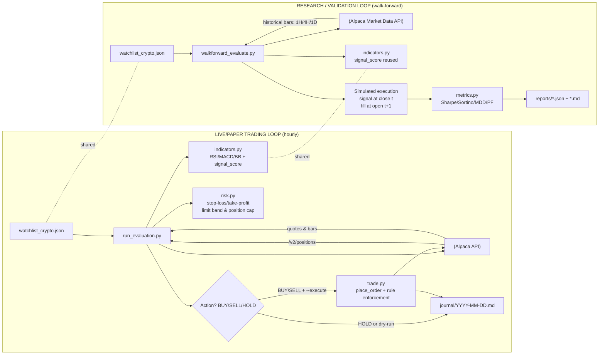

# Alpaca Crypto Trading Agent

A fully automated crypto trading agent running on Alpaca paper trading. The agent evaluates
10 crypto symbols every hour using a 6-point Signal Confluence strategy, places limit orders
when a score threshold is met, and journals every decision. A walk-forward backtester runs
daily to validate strategy robustness.

---

## Architecture



---

## Watchlist

Defined in `watchlist_crypto.json`. Crypto symbols use Alpaca's slash form (`BTC/USD`).
All 10 symbols trade 24/7 — the `/v2/clock` market-hours gate is **not** used.

| Symbol    | Symbol    |
|-----------|-----------|
| BTC/USD   | LTC/USD   |
| ETH/USD   | DOGE/USD  |
| SOL/USD   | ADA/USD   |
| AVAX/USD  | AAVE/USD  |
| LINK/USD  | DOT/USD   |

---

## Portfolio Caps (`portfolio_caps.json`)

Hard limits on position size as a fraction of total equity. Enforced at runtime by both
`run_evaluation.py` (sizing) and `trade.py` (final guard before order submission).

| Symbol   | Max % equity |
|----------|-------------|
| BTC/USD  | 30%         |
| ETH/USD  | 15%         |
| ADA/USD  | 10%         |
| SOL/USD  | 10%         |
| DOGE/USD | 8%          |
| LTC/USD  | 6%          |
| DOT/USD  | 6%          |
| LINK/USD | 5%          |
| AVAX/USD | 5%          |
| AAVE/USD | 5%          |
| *(other)* | 5% (default) |

---

## Trading Strategy

The agent uses a **6-point Signal Confluence** scoring system applied to 15-min bars,
filtered by 4H trend and daily regime. Full strategy detail lives in
`skills/crypto-trader/SKILL.md`.

### Signal Confluence Table

| # | Indicator | Bullish | Bearish |
|---|-----------|---------|---------|
| 1 | EMA cross 20/50 (15-min) | Golden cross +1 | Death cross −1 |
| 2 | MACD histogram | Green and rising +1 | Red and falling −1 |
| 3 | RSI | 40–65 rising or <30 oversold +1 | >70 overbought −1 |
| 4 | Bollinger %b | Near lower band (<0.25) +1 | Near upper band (>0.75) −1 |
| 5 | Volume | ≥1.2× 20-bar avg +1 | <0.7× avg −0.5 |
| 6 | 4H trend | 20 EMA > 50 EMA on 4H +1 | 20 EMA < 50 EMA on 4H −1 |

**Entry rules:** score ≥ 4 → BUY full size · score = 3 → BUY half-size (R:R ≥ 1:3) · score ≤ 2 → HOLD

### Risk Rules (hard — cannot be overridden)

- **Limit orders only** — market orders are rejected by `trade.py`.
- **Limit band** — limit price must be within 0.2% of current ask.
- **Stop-loss** — close immediately if a position drops 5% from entry.
- **Take-profit** — close immediately if a position gains 10% from entry.
- **Regime gate** — no new buys in a confirmed daily downtrend (last close < 50-day SMA and 20-day SMA < 50-day SMA).
- **ATR-based sizing** — `qty = (equity × 1%) / (ATR × 1.5)`, hard-capped by `portfolio_caps.json`.

---

## Scripts

| Script | Purpose |
|--------|---------|
| `scripts/run_evaluation.py` | Core evaluation loop — fetches bars, scores signals, decides BUY/SELL/HOLD, optionally places orders, writes journal |
| `scripts/trade.py` | Single gateway for all orders — enforces limit-only, limit-band, position-cap, and crypto 24/7 rules |
| `scripts/indicators.py` | Pure-function TA library — EMA, SMA, RSI, MACD, Bollinger Bands, ATR, signal_score |
| `scripts/risk.py` | Pure-function risk checks — position-cap, limit-band, stop-loss, take-profit thresholds |
| `scripts/walkforward_evaluate.py` | Walk-forward backtester — signal at bar close, fill at next open, supports 1H/4H/1D timeframes |
| `scripts/metrics.py` | Performance metrics — Sharpe, Sortino, max drawdown, profit factor |
| `scripts/verify.py` | Credential and connectivity verification |
| `scripts/_env.py` | Loads `.env` into `os.environ` at import time |

### Usage

```bash
# Dry-run (no orders placed)
python scripts/run_evaluation.py

# Execute mode (orders submitted to Alpaca)
python scripts/run_evaluation.py --execute

# Walk-forward backtest (BTC + ETH, 2024–2026, three timeframes)
python scripts/walkforward_evaluate.py \
  --symbols BTC/USDC ETH/USDC \
  --start 2024-01-01 --end 2026-05-01 \
  --train-days 90 --test-days 30 \
  --timeframes 1H 4H 1D \
  --fee-bps 5 --slippage-bps 5

# Quote / order / status via trade.py directly
python scripts/trade.py status
python scripts/trade.py quote BTC/USD
python scripts/trade.py order BTC/USD 0.001 buy 95000.00
```

---

## GitHub Actions Automation

Two workflows in `.github/workflows/` drive fully autonomous operation.

### `trade.yml` — Trading Bot

| Trigger | Schedule | What runs |
|---------|----------|-----------|
| Cron | Every hour at **:23** | `run_evaluation.py --execute` (paper) |
| Cron | Daily at **23:11 UTC** (≈ 01:11 Amsterdam) | Daily journal summary |
| Manual dispatch | On demand | Configurable: `paper`/`live`, dry-run on/off |

- Secrets: `APCA_PAPER_KEY_ID` / `APCA_PAPER_SECRET_KEY` (paper) and `APCA_LIVE_KEY_ID` / `APCA_LIVE_SECRET_KEY` (live).
- Concurrency group `trading-bot-{ref}` prevents simultaneous runs.
- Journal changes are committed back to `main` with rebase-retry logic (3 attempts).

### `forward.yml` — Forward Analysis

| Trigger | Schedule | What runs |
|---------|----------|-----------|
| Cron | Daily at **08:11 UTC** | Walk-forward evaluation for BTC/USDC + ETH/USDC across 1H, 4H, 1D |
| Manual dispatch | On demand | Same |

- Always runs against the `paper` environment.
- Results (JSON + Markdown) are committed to `reports/`.

---

## Journal

One Markdown file per calendar day in `journal/YYYY-MM-DD.md`, following `journal/_template.md`.

The bot appends three types of block:

1. **`## Evaluation HH:MM GMT+2`** — written after every `:23` run (24× per day). Contains a one-line decision per symbol plus the full indicator breakdown for each.
2. **`## Research HH:MM GMT+2`** — market research block written on the hour.
3. **`## Daily Summary`** — written once at end of day (23:21 GMT+2).

Example journal block structure:
```
## Evaluation 14:23 GMT+2

- BTC/USD HOLD score=+2.0/6 ask=$97340.0000 (HOLD 0.0312 @ $95100.0000 (2.36%), score=2.0)
    score   : +2.0/6
    ema_x   : golden
    rsi     : 54.32
    macd    : line=120.4 sig=98.2 hist=22.2 (BULLISH FLIP)
    bb      : lower=96000 mid=97200 upper=98400 bw=0.0240 pb=0.56 trend=widening
    atr     : 320.0000  stop_1.5x=480.0000
    4h      : golden
    daily   : ma20=95000 ma50=90000 last=97340 regime=uptrend
    signals :
      ema_cross:    GOLDEN (20>50, +1)
      ...

### No orders submitted
```

---

## Walk-Forward Reports

Stored in `reports/` as paired `*.json` + `*.md` files, timestamped in UTC.

Latest report (`walkforward_20260514T103155Z`) summary — 23 windows, 2024-01-01 → 2026-05-01:

| Timeframe | Symbol    | Avg Sharpe | Median MDD |
|-----------|-----------|-----------|-----------|
| 1H        | BTC/USDC  | +0.38     | −0.53%    |
| 1H        | ETH/USDC  | −0.30     | −0.74%    |
| 4H        | BTC/USDC  | −0.00     | −0.42%    |
| 4H        | ETH/USDC  | −1.22     | −0.60%    |
| 1D        | BTC/USDC  | +0.27     | −0.36%    |
| 1D        | ETH/USDC  | −0.97     | −0.58%    |

---

## Dashboard

Two self-contained HTML dashboards live in `dashboard/`. Open either locally in a browser — no server required.

### `dashboard/dashboard_professional.html` *(primary)*

Professional trader decision cockpit with 7 tabs: **Command**, **Performance**, **Risk**, **Positions**, **Execution**, **Backtest vs Live**, **Settings**.

Key features (updated 2026-05-16):
- **Hard Rules panel** — Command tab lists all CLAUDE.md hard rules at a glance.
- **Cash Reserve rule** — Command Center checks cash ≥ 20% of equity (red if breached, yellow below 25%).
- **Cash Reserve KPI** — top-row metric replacing the removed Rule Adherence tile.
- **Stop Distance column** — Positions table shows current P&L % vs the −5% hard-stop, with distance remaining before auto-close triggers.
- **Portfolio Cap Usage column** — Risk table shows current allocation vs each symbol's cap from `portfolio_caps.json`.
- **ATR Position Sizer** — built into the trade modal: enter equity, ATR, ask and cap% to get the 1%-risk-rule quantity, stop price and R:R.
- **Auto-refresh toggle** — 60-second timer button in the header.
- **Journal tab removed** — journal tracking is handled by the agent-written `.md` files in `journal/`.

### `dashboard/dashboard.html` *(legacy)*

Original lighter dashboard — 3 tabs: Overview, Hot Symbols, Morning Brief.

---

## Configuration

### Environment Variables (`.env`)

```
APCA_API_KEY_ID=<your key>
APCA_API_SECRET_KEY=<your secret>
APCA_BASE_URL=https://paper-api.alpaca.markets   # or https://api.alpaca.markets for live
```

### Claude Agent Settings (`.claude/settings.local.json`)

Grants the agent permission to stage files for git commits:
```json
{
  "permissions": {
    "allow": ["Bash(git add *)", "Bash(git rm *)"]
  }
}
```

### Claude Agent Routines (`.claude/routines.json`)

Scheduled routines are managed via the Cowork agent. Current routines: none active
(schedules are driven by GitHub Actions instead).

---

## Repository Structure

```
alpaca-trading-agent/
├── .claude/
│   ├── routines.json          # Cowork agent routine definitions
│   └── settings.local.json    # Agent permission grants
├── .github/workflows/
│   ├── trade.yml              # Hourly trading + daily summary
│   └── forward.yml            # Daily walk-forward analysis
├── dashboard/
│   ├── dashboard.html                  # Legacy dashboard (3 tabs)
│   ├── dashboard_professional.html     # Professional dashboard (7 tabs, primary)
│   └── dashboard_layout.md            # Dashboard design notes
├── journal/
│   ├── _template.md           # Journal entry template
│   └── YYYY-MM-DD.md          # One file per calendar day
├── memory/
│   ├── glossary.md            # Domain glossary
│   └── projects/
│       └── alpaca-trading-agent.md
├── reports/
│   └── walkforward_*.json/md  # Walk-forward backtest results
├── scripts/
│   ├── _env.py                # .env loader
│   ├── indicators.py          # Pure-function TA (EMA/RSI/MACD/BB/ATR)
│   ├── metrics.py             # Performance metrics (Sharpe/MDD/PF)
│   ├── research.py            # Market research helper
│   ├── risk.py                # Risk rule enforcement
│   ├── run_evaluation.py      # Main evaluation + order placement
│   ├── trade.py               # Alpaca order gateway
│   ├── verify.py              # Credential/connectivity check
│   └── walkforward_evaluate.py # Walk-forward backtester
├── skills/crypto-trader/
│   └── SKILL.md               # Full trading strategy playbook
├── .env                       # API credentials (git-ignored)
├── .gitignore
├── CLAUDE.md                  # Agent operating instructions
├── portfolio_caps.json        # Per-symbol position caps
├── requirements.txt           # Python dependencies
└── watchlist_crypto.json      # Symbols to trade
```

---

## Dependencies

See `requirements.txt`. Core packages: `requests`, `numpy`, `pandas`.
Python 3.11 is used in CI; 3.10+ works locally.

---

## Paper vs Live Trading

The workflow supports both environments via the `environment` input on manual dispatch.
Paper trading is the default for all scheduled runs. Live trading requires separate
GitHub secrets (`APCA_LIVE_KEY_ID` / `APCA_LIVE_SECRET_KEY`) and an explicit manual trigger.

> **Note:** This is a paper trading agent for research purposes. Past backtest performance
> does not guarantee future results.
