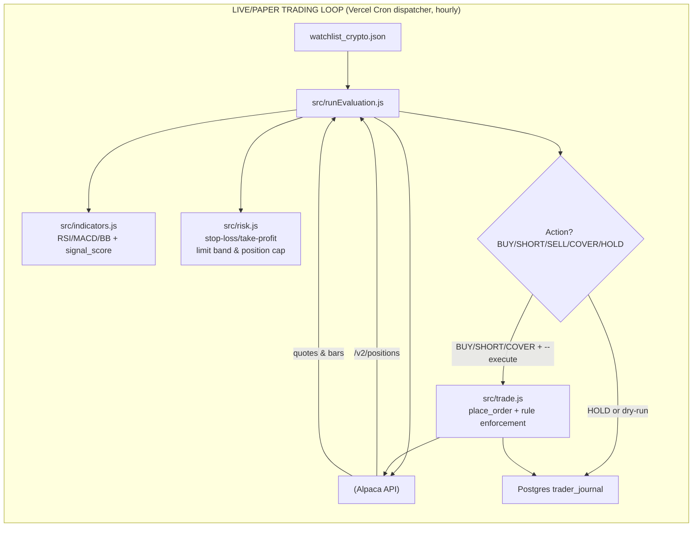

# CryptoPro Trader

## Description: 
A fully automated crypto trading agent running on Alpaca. The agent evaluates pre-selected crypto symbols every hour using a 6-point Signal Confluence strategy, places limit orders
when a score threshold is met, and journals every decision.

**Node.js + React, deployed on Vercel with a Supabase (Postgres) database.** The Node engine
(`src/`, 545-test `node --test` suite via `npm test`) is the sole trading engine, running as
Vercel Cron-triggered HTTP endpoints (`src/cronRoutes.js` + `vercel.json`, `CRON_EXECUTE=true`).
There is no Python and no CI/CD workflow anywhere in this project. Walk-forward backtesting was
removed outright on 2026-07-30 (Suite roadmap item 4), taking the Backtest tab's baseline banner
with it — the banner had permanently reported a report file that no longer existed.

---

## Setup: Connecting to Alpaca (Paper & Live)

CryptoPro Trader trades through the [Alpaca Trading API](https://docs.alpaca.markets/). One Alpaca
account gives you two independent environments — **paper** (simulated money, unlimited) and **live**
(real money) — each with its own API key pair and base URL.

> **Paper trading only.** This project never places an order on a live account. Live credentials are
> accepted but **read-only**: account, positions, orders and quotes load so the dashboard can still
> show insights, while order placement and cancellation are blocked in both the Node engine
> (`src/alpacaClient.js`) and the dashboard (`src/js/api-config.js`). Both guards fail closed — an
> unset or unrecognised base URL is treated as live. This is a hard rule (Suite workflow rule 30,
> EU MiCA) and stays in force until MiCA clearance is given.

### 1. Create an Alpaca account and API keys

1. Sign up at [alpaca.markets](https://alpaca.markets) and verify your account.
2. In the Alpaca dashboard, use the account switcher to select **Paper Trading**.
3. Go to **API Keys** and generate a paper key pair — copy the **Key ID** and **Secret Key** immediately
   (the secret is shown once and can't be retrieved again, only regenerated).
4. Live keys are optional and only ever used read-only (see the note above) — they require identity
   verification and a funded account.

### 2. Local development (`.env`)

Create a `.env` file at the project root (already covered by `.gitignore` — never commit it).
`src/env.js`'s `loadEnv()` loads it into `process.env` automatically:

```env
APCA_API_KEY_ID=<your paper key id>
APCA_API_SECRET_KEY=<your paper secret key>
APCA_BASE_URL=https://paper-api.alpaca.markets   # the only URL that can place orders; defaults to this when unset
```

Install dependencies and verify the connection:

```bash
npm install

set -a; source .env; set +a

# Confirms keys + base URL work (200 = OK)
curl -s -o /dev/null -w "%{http_code}\n" "$APCA_BASE_URL/v2/account" \
  -H "APCA-API-KEY-ID: $APCA_API_KEY_ID" -H "APCA-API-SECRET-KEY: $APCA_API_SECRET_KEY"

# Confirms market-data access
curl -s "https://data.alpaca.markets/v1beta3/crypto/us/latest/quotes?symbols=BTC/USD" \
  -H "APCA-API-KEY-ID: $APCA_API_KEY_ID" -H "APCA-API-SECRET-KEY: $APCA_API_SECRET_KEY"
```

A `401`/`403` response means the key pair doesn't match `APCA_BASE_URL` (e.g. paper keys against the
live URL, or vice versa) — regenerate or fix the pairing rather than guessing.

### 3. Automated trading

Live trading runs entirely on the Node/Vercel engine — see [§6 Scheduled jobs via Vercel Cron](#6-scheduled-jobs-via-vercel-cron-live-paper-engine).
There is no GitHub Actions workflow of any kind in this project — credentials for the live engine are
Vercel environment variables (Production/Preview/Development), not GitHub Environments secrets.

### 4. Dashboard (optional)

The dashboard's **⚙ Settings** tab has its own **Paper Spot Trading** and **Live Trading** API Key/Secret
fields, persisted to browser `localStorage` and sent only to Alpaca directly from the browser — these never
sync to the database and stay in this browser only, even when signed in. These are independent of `.env`
— set them only if you want to place paper trades or pull account data from the dashboard UI itself.
Selecting **Live Trading** puts the dashboard in read-only mode (a 🔒 badge appears in the header):
insights load, but the trade ticket, Autopilot and every cancel action are disabled. Other Settings fields (trading mode, position limits) and preferences elsewhere in the dashboard
(theme, last tab, watchlist, backtest-form defaults) do sync to the signed-in account's row in the shared
Postgres database (`src/js/settings-sync.js`), so they follow you across devices/browsers.

Below those fields, a separate **☁ Server-Side Trading Engine** panel does something different and is
styled differently to say so. Its credentials go to the *server*, encrypted, and are used by your
scheduled jobs — which run whether or not this browser is open. That panel is also where you edit your
per-account strategy overrides as JSON. Connecting a key there is what makes your account a tenant of the
scheduled engine; the browser fields above never are. See *Per-user Alpaca credentials* below.

This panel is a **Pro** feature. A free signed-in account sees a "Pro feature" banner with an Upgrade to
Pro button instead of the credential form — the browser-only fields above stay free for everyone.

> **Safety:** pointing `APCA_BASE_URL` (or the dashboard's mode selector) at live does not enable live
> trading — it makes the connection read-only. Orders can only be placed against
> `https://paper-api.alpaca.markets`. Confirm the connectivity check above and a paper order round-trip
> end-to-end (e.g. `node src/runEvaluation.js` dry-run, or a manual order from the dashboard's trade
> ticket) before trusting the strategy.

### 4b. User manual

Click the **❓** button in the header (next to the theme toggle) to open the in-app user manual — an
off-canvas panel that unfolds from the left with a section list and search box covering every tab group,
account sign-in, and keyboard shortcuts. Static content, no network call; `src/js/manual.js` +
`src/css/manual.css`.

### 5. Account sign-in (Suite SSO, optional)

The dashboard header has a **👤 Sign in** button (username/password, with optional TOTP 2FA) backed
by `src/auth.js` + `src/db.js` + `src/totp.js` — the same accounts/sessions pattern already running in
CryptoPro Charts and CryptoPro Suite. As of 2026-07-24, Vercel's Supabase integration provisions this
project's own `CRYPTOPROTRADER_POSTGRES_URL[_NON_POOLING]` vars pointing at the same shared Supabase
project Charts uses under its own `CRYPTOPROCHARTS_*` prefix (see `.env.example`) — same database,
per-project var names, so one login is still shared across the whole suite. Older
`DBCRYPTOCHARTS_POSTGRES_URL[_NON_POOLING]` vars are still accepted as a fallback.
Without a connection string, sign-in/register return 503 and the rest of the dashboard works unaffected.
The "Enable 2FA" dialog shows a scannable QR code (any TOTP authenticator app) alongside the manual-entry
secret, generated client-side via a vendored `qrcode-generator` (no network call).

The account modal also lets you save a notification email (`accounts.notification_email`), unrelated to
sign-in. It's captured and persisted only — nothing sends a notification anywhere yet.

The account modal's **Danger zone** deletes the account. Because one account is shared across the whole
suite, this removes your data from Charts and Training as well — including, from this app, any connected
Alpaca credentials, the server-side engine's state and journal, and your schedules and strategy overrides.
Deletion asks for your password, your exact username, and your 2FA code when enabled. It takes effect
immediately (you are signed out everywhere and can no longer sign in) but is **reversible by an
administrator for 30 days**; after that a scheduled job in CryptoPro Suite erases the data permanently.

The session cookie is shared across the whole suite (`Domain=.cryptoprosuite.com` in production), so
signing in on any CryptoPro app signs you in here too — including opening this dashboard cold from a
bookmark, not just clicking through from another app. On top of that, Suite's landing page and every
app's account modal **Switch app** row also mint a short-lived, single-use `?sso=` ticket before
navigating, which is what actually carries you over on the `.vercel.app` fallback domains (they don't
share the `cryptoprosuite.com` cookie) and gives an instant handoff even before the shared cookie exists.

### 6. Scheduled jobs via Vercel Cron (live paper engine)

`GET /api/cron/dispatch` is a dispatcher that checks each job's dashboard-configured hour (Command tab's
"☁ Scheduled Jobs" panel) and runs it once per UTC day at that hour — this is the live trading engine.
This project is on **Vercel Pro**, so `vercel.json`'s own cron entry drives the dispatcher directly,
hourly (`0 * * * *`). Two env vars control it, both optional:

- `CRON_SECRET` — Vercel sends `Authorization: Bearer $CRON_SECRET` with every scheduled call; without
  it, scheduled runs 401 (the dashboard's signed-in "Run now" still works).
- `TRADER_OWNER_UID` — **removed.** The engine has no single owner any more: every account that
  connects its own Alpaca credentials becomes a tenant with its own schedule, state, journal and
  strategy config, and the "☁ Scheduled Jobs" panel shows each signed-in account **its own** jobs.
  An account with no connected credential is not a tenant, so its schedule never runs — the panel
  says so rather than showing an enabled toggle that does nothing.
- `CRON_EXECUTE` — **`true` in production.** These routes place real paper orders when set. Leave unset
  in any environment where real order placement isn't wanted (local dev, a fork, etc.).

### 7. Per-user Alpaca credentials (multi-tenant, in progress)

Each signed-in account stores its own Alpaca API credentials for the server-side engine, instead of
every scheduled run using the one shared `APCA_*` env-var account. **Phases 2–5 of 6 done** — the
dispatcher now loops per (job, tenant), so each account runs on its own schedule, state, journal and
strategy config. See CLAUDE.md "Multi-tenant engine — standing rules".

**Connecting credentials is what makes an account a tenant.** The dispatcher visits only accounts with
an active credential, and it never falls back to the `APCA_*` env-var account for one that lacks
it — a fallback would place that user's orders on someone else's Alpaca account while the engine
looked perfectly healthy. An account with no credential is skipped with a reason, and the Scheduled
Jobs panel says so instead of showing a schedule that will never run.

| Route | Purpose |
|-------|---------|
| `GET /api/alpaca-credentials` | Which modes are connected, which is active, last 4 of each key id, recent activity |
| `POST /api/alpaca-credentials/:mode` | Connect/replace (`{keyId, secret, activate?}`); `:mode` is `paper` or `live` |
| `POST /api/alpaca-credentials/:mode/activate` | Choose which stored credential the engine uses |
| `DELETE /api/alpaca-credentials/:mode` | Disconnect |
| `GET /api/strategy-config` | This account's overrides, the shipped defaults, and which keys are settable within what bounds |
| `PUT /api/strategy-config` | Save overrides (`{config:{...}}`) — **rejects** on any invalid, unknown or locked key |
| `DELETE /api/strategy-config` | Revert to the shipped defaults |

All require a signed-in session and act only on that account's own rows. The credential API is
**write-only** — no route returns a stored key or secret. Secrets are encrypted with AES-256-GCM
(`src/secretsCrypto.js`) before they reach the database, so a database dump alone yields no usable keys.

**Destructive credential changes ask for your account password** (step-up auth): disconnecting, or
replacing the credential the engine is currently trading with. Connecting your first key and switching
between keys you already stored do not — they take nothing away. Every change is recorded in
`trader_credential_audit` and shown under *Recent credential activity* in the Settings panel.

`PUT /api/strategy-config` is deliberately **stricter than the engine's own read path**. The engine
merges what validates and drops what doesn't, so one stale value can never stop a running engine; a save
you are watching does the opposite and refuses, because a silently dropped key would read as "saved"
while the engine kept trading the old number. Values outside the bounds in `src/userConfig.js`'s
`CONFIG_SPEC` — the 0.2% limit band, ≤30% symbol cap, ≤2% risk per trade, 7 total / 5 per-tier budget,
≤8% swing-low stop — and every locked setting (shorts, the streak throttle, all ships-OFF flags) are
rejected here, so the hard rules cannot be edited through this surface.

- `TRADER_CREDENTIALS_ENC_KEY` — 32 random bytes, base64 (`openssl rand -base64 32`). Unset means these
  routes fail closed with 503 and nothing is ever stored in plaintext. **Use a different value per Vercel
  environment** — add the variable three times, each scoped to exactly one environment (the Vercel form
  pre-ticks all three, which is how a shared key happens). With one key and the shared database, any
  preview build of any branch could decrypt production credentials. There is no key-rotation path yet:
  changing it makes already-stored credentials unreadable and users must reconnect.

  **All environments share one Supabase database, so isolation is per-row, not per-environment.**
  `trader_alpaca_credentials` is keyed `(uid, mode)` and the write is an upsert, so connecting the same
  account from two environments replaces the ciphertext and the other environment can no longer read it —
  which the engine sees as "credential disconnected". The rule that keeps this safe: **outside Production,
  never sign in as your real account** — use a throwaway test account (`vercel dev` hits the shared
  database too). Each row records a `key_fp` (a non-secret SHA-256 prefix of the key that wrote it), so a
  violation surfaces as `KeyMismatch` — a 409 naming the real cause, and `readableHere: false` in the
  credential listing — instead of a silent stop. It diagnoses the mistake; it does not prevent it.

**Per-user strategy config (Phase 3).** Alongside credentials, each account can have its own copy of the
strategy/risk tunables, stored in `trader_strategy_config` as just the keys it overrides.
`resolveConfigForUser(uid)` in `src/userConfig.js` merges that row over the compiled `config.json`
defaults; no uid (the CLI, and every path until Phase 5) resolves to exactly the compiled values.

Overrides are validated against `CONFIG_SPEC` on **every read**, not only on write, so a value edited
straight into the database still cannot reach a trading decision. Two categories are refused outright:

- **Out-of-bounds** — the bounds encode the hard rules below (0.2% limit band, 0.5% stop band, ≤30%
  per-symbol cap, ≤2% risk per trade, 7 total / 5 per-tier budget, ≤8% swing-low stop). A user may
  tighten any of these, never loosen them.
- **Locked keys** — shorts (Alpaca crypto is spot-only), the streak throttle, and every ships-OFF
  feature that was never ported to `src/risk.js` (pyramiding, conviction sizing, measured-move
  targets, breadth gate, maker-first entries, chandelier trail).

An invalid key degrades to its default and is reported, rather than failing the whole resolve — a bad
row must not be able to stop a user's engine, including its stop watchdog. **No route writes a config
row yet**; the editor UI and its route arrive with Phase 6.

Storing live credentials is allowed (the engine uses live keys for read-only insight), but the
paper-trading-only hard rule is unaffected — `assertPaperTrading()` independently blocks all order
placement and cancellation on the live host.

**Uid-keyed engine tables (Phase 4).** The four tables the scheduled engine writes are keyed by
account: `trader_state.id` holds the owning uid, `trader_journal` is `(uid, day)`, `cron_config` is
`(uid, job)`, and `job_runs` carries a `uid` whose concurrency-lock index moved from `(job)` to
`(uid, job)`. That last one is a correctness fix rather than an isolation nicety — on a `(job)`-only
lock, two accounts' evaluate runs contend for one row and block each other. Every `db.js` accessor
takes the uid first and throws if it is missing, so a uid-less call can never silently read or
overwrite another account's positions.

Existing single-tenant databases are reshaped by a one-shot script rather than by `init()`, because
`init()` boots in every environment against the one shared database and attributing existing rows to
an account is a once-only decision:

```bash
node scripts/backupPhase4Tables.mjs          # JSON snapshot -> backups/ (gitignored)
node scripts/migratePhase4.mjs               # dry run: prints the plan, changes nothing
node scripts/migratePhase4.mjs --confirm     # applies it in one transaction
# then deploy immediately
```

The migration is idempotent and refuses a uid that isn't an account. `trader_state`'s legacy
`id='trader'` row is copied rather than moved, so it remains as a rollback point. Deploy right after
committing it: in between, the previously deployed code runs against the new schema and its
`ON CONFLICT` clauses error, so scheduled jobs fail (loudly, before placing any order) until the new
build is live. `db.init()` warns at boot if a database still has the old primary keys.

---

## Architecture


```mermaid
flowchart LR
  subgraph LIVE["LIVE/PAPER TRADING LOOP (Vercel Cron dispatcher, hourly)"]
    A[watchlist_crypto.json] --> B["src/runEvaluation.js"]
    B --> C["(Alpaca API)"]
    C -->|/v2/positions| B
    C -->|quotes & bars| B
    B --> D["src/indicators.js\nRSI/MACD/BB + signal_score"]
    B --> E["src/risk.js\nstop-loss/take-profit\nlimit band & position cap"]
    B --> F{Action? BUY/SHORT/SELL/COVER/HOLD}
    F -->|BUY/SHORT/COVER + --execute| G["src/trade.js\nplace_order + rule enforcement"]
    G --> C
    F -->|HOLD or dry-run| H["Postgres trader_journal"]
    G --> H
  end
```

Note: there is no walk-forward backtesting in this project. The Python pipeline went with the rest of the
Python engine (2026-07-25), and the dashboard banner that read its output was removed 2026-07-30.

---

## Watchlist

Defined in `watchlist_crypto.json`. Crypto symbols use Alpaca's slash form (`BTC/USD`).
All 10 symbols trade 24/7 — the `/v2/clock` market-hours gate is **not** used.

| Symbol    | Symbol    |
|-----------|-----------|
| BTC/USD   | LTC/USD   |
| ETH/USD   | DOGE/USD  |
| SOL/USD   | ADA/USD   |
| AVAX/USD  | AAVE/USD  |
| LINK/USD  | DOT/USD   |

---

## Portfolio Caps (`portfolio_caps.json`)

Hard limits on position size as a fraction of total equity. Enforced at runtime by both
`src/runEvaluation.js` (sizing) and `src/trade.js` (final guard before order submission).

Keys use the canonical slash form (`BTC/USD`) to match the watchlist — no conversion needed.

| Symbol   | Max % equity |
|----------|-------------|
| BTC/USD  | 30%         |
| ETH/USD  | 15%         |
| ADA/USD  | 10%         |
| SOL/USD  | 10%         |
| DOGE/USD | 8%          |
| LTC/USD  | 6%          |
| DOT/USD  | 6%          |
| LINK/USD | 5%          |
| AVAX/USD | 5%          |
| AAVE/USD | 5%          |
| *(other)* | 5% (default) |

---

## Trading Strategy

The agent uses a **6-point Signal Confluence** scoring system applied to 15-min bars,
filtered by 4H trend and daily regime. Full strategy detail lives in
`skills/crypto-trader/SKILL.md`.

The agent's operating knowledge lives in two skills in `skills/`:

| Skill | Role |
|-------|------|
| `crypto-trader/SKILL.md` | Execution playbook — scoring, Wyckoff, entries/exits, sizing |
| `crypto-catalysts/SKILL.md` | News & event interpretation — T1/T2/T3 catalyst severity ladder (hacks, depegs, unlocks, ETF flows, funding extremes, macro windows). Defensive only: news can veto/downsize entries or flag positions for close, never justify an entry below the score gates |

### Signal Confluence Table

| # | Indicator | Bullish | Bearish |
|---|-----------|---------|---------|
| 1 | EMA cross 20/50 (15-min) | Golden cross +1 | Death cross −1 |
| 2 | MACD histogram | Green and rising +1 | Red and falling −1 |
| 3 | RSI | 40–65 rising or <30 oversold +1 | >70 overbought −1 |
| 4 | Bollinger %b | Near lower band (<0.25) +1 | Near upper band (>0.75) −1 |
| 5 | Volume | ≥1.2× 20-bar avg +1 | <0.7× avg −0.5 — **n/a (0)** when fewer than 10 of the 20 baseline bars traded, or when the measured bar had no trades at all |
| 6 | 4H trend | 20 EMA > 50 EMA on 4H +1 | 20 EMA < 50 EMA on 4H −1 |

**Long entry rules:**
- uptrend/mixed, score ≥ 3.5 → BUY full size
- uptrend/mixed, score ≥ 2.5 (and < 3.5) → BUY half-size
- confirmed downtrend, score ≥ 4.0 → BUY half-size (counter-trend; `downtrend_long_score_threshold`)
- otherwise → HOLD

**Short entry rules (confirmed daily downtrend only):**
- score ≤ −4 → SHORT full size
- score = −3 → SHORT half-size (R:R ≥ 1:3)
- score > −3 → HOLD

**Exit rules:**
- Long: TA SELL when score ≤ −2; **swing-low stop** at the previous 4H range low (lowest low of the last 20 4H bars, clamped ≤8% below entry; −5% fallback when no 4H data)
- Short: COVER when score ≥ +2 (TA turning bullish); hard stop at +5% from entry (price rose)

All thresholds are configured in `config.json` — edit there, not in source files.

### Risk Rules (hard — cannot be overridden)

- **Limit orders only** — market orders are rejected by `src/trade.js`.
- **Limit band** — limit price must be within 0.2% of current ask for normal orders, 0.5% for stop-loss orders (`config.json > risk.limit_band_pct` / `stop_loss_limit_band_pct`).
- **Long stop-loss (4H swing low)** — TA-driven: close immediately when price falls to/through the previous 4H range low — the lowest low of the last `risk.swing_low_lookback_bars` (20) completed 4H bars, less a small buffer, clamped to at most `risk.swing_low_max_stop_pct` (8%) below entry (`risk.stop_loss_mode = "swing_low_4h"`). Falls back to the fixed −5% (`risk.stop_loss_pct`) only when 4H history is unavailable.
- **Trailing stop** — activates at +2.5% profit, then trails 3% below the high-water mark (HWM). HWM survives evaluation cycles; it is persisted to the Postgres `trader_state` row on the deployed (serverless) engine and to `data/positions_state.json` only on the local CLI path — see `src/positionState.js` in the module table below. Once active, the trailing stop supersedes the swing-low stop.
- **Stop-loss deduplication** — before placing any SELL/COVER stop order, `get_open_orders(symbol)` is called. If a pending order exists, re-sending is skipped. After `stop_loss_escalation_cycles` (2) unfilled cycles, the stale order is cancelled and replaced with a slightly wider limit (time-escalation via `stop_loss_limit_price(ask, cycles_open)`).
- **Short stop-loss** — cover immediately if a short position rises 5% from entry. Enforced by `risk.should_cover_short()`.
- **TA exit (long)** — SELL when Signal Confluence score drops to ≤ −2.
- **TA cover (short)** — COVER when Signal Confluence score rises to ≥ +2 (bullish flip).
- **Regime gate (long)** — in uptrend/mixed, BUY entries allowed at score ≥ 2.5 (half) / ≥ 3.5 (full). In a confirmed daily downtrend (last close < 50-day SMA and 20-day SMA < 50-day SMA), only a **half-size counter-trend long** at score ≥ 4.0 is allowed; otherwise longs are blocked.
- **Regime gate (short)** — SHORT entries only in a confirmed daily downtrend. No shorts in uptrend or mixed regime.
- **Correlation budget** — max open positions total and max per tier are **user-configurable** (defaults: **7 total, 5 per tier** — corrected 2026-07-30, this line had said 4/3 while `config.json` has said 7/5; Tier-1: BTC/USD + ETH/USD; Tier-2: all other alts). New entries are blocked when either limit is hit. The Node engine reads the caps from `config.json › risk.max_open_positions` / `max_positions_per_tier` (enforced by `src/risk.js`'s `correlationBudgetAllows()`); the dashboard Autopilot reads them from **Settings › 🔗 Correlation Budget**.
- **Daily drawdown gate** — if equity drops ≥ 3% vs. day-open equity, capital preservation mode activates: all new entries are blocked and existing stops tighten to 3%. State persists alongside the HWM (Postgres `trader_state` when deployed, `data/positions_state.json` on the local CLI path) and resets at midnight UTC.
- **ATR-based sizing** — `qty = (equity × 1%) / (ATR × 1.5)`, hard-capped by per-symbol cap in `config.json > portfolio_caps.caps`. Applied identically for long and short entries.
- **Manual trade-ticket cap check** *(bugfix, 2026-07-18)* — the dashboard's manual Execute Paper Trade dialog (`submitPaperTrade()`) previously only validated qty/price were positive; it never checked the per-symbol portfolio cap, so a BUY could be entered and submitted well past its cap, tripping the Command tab's "STOP" trading-permission indicator only after the fact. `tradeCapProjection()` now projects the position's post-order notional against `portCapFor(symbol)` × equity — shown live in the ticket as you type, and a BUY that would breach the cap is blocked before submission with the max additional qty allowed at that price. Mirrors the cap enforcement the Node engine already applies to automated orders.
- **Partial take-profit + break-even ladder** *(2026-07-09)* — at +1R (R = entry − swing-low stop) sell `risk.partial_tp_fraction` (50%) and raise the remaining stop to breakeven; the remainder rides the trailing stop. Fires once per position (`partial_tp_done`/`breakeven_stop` in `data/positions_state.json`). **Bug #6 fix (2026-07-18):** the fill-history reconciliation that restores this flag after a lost state file (`reconcile_positions_from_fills()`) was misreading fee-rounded full-position closes (Alpaca SELL fills land ~0.1–0.25% short of the matching BUY qty) as partial scale-outs, so brand-new positions were pinning the stop to breakeven on their very first evaluation — causing fast, mostly-losing round trips. Fixed by comparing leftover lot qty to a tolerance relative to the lot's original size instead of a fixed epsilon. **Bug #7 fix (2026-07-18):** a full close via any stop-loss-type exit (swing-low stop, trailing stop, breakeven-after-partial-TP) never called `ps.clear_position()` — only a non-stop-loss TA exit did — so the stale `partial_tp_done`/`breakeven_stop`/`stop_order_id` from a closed position survived indefinitely and got misapplied to the next, unrelated position opened for that symbol. The dashboard Autopilot already pruned this correctly every cycle (`if (!heldSyms.includes(k)) delete hwm[k]/partialTp[k]/entryTime[k]`); the cron engine gained the equivalent `pruneStaleState()` pass, run once per evaluation right after the live positions fetch. **Bug #8 fix (2026-07-18):** the Autopilot's cross-engine `partial_tp_done`/`entry_time_iso` merge (so it agrees with the cron engine on "has the +1R scale-out already fired for this position") depended on `fetch()`-ing `data/positions_state.json` as a relative same-origin file — the same class of bug just fixed for the Glossary tab, silently blocked when the dashboard is opened via `file://`. When the merge silently no-opped, neither engine's local flag was set, so the Autopilot re-fired its own 50%-of-remainder partial-TP sell every cycle it ran — a halving cascade visible in fill history (e.g. AAVE: 6.54 → 0.82 → 0.41 → 0.20 → 0.10 → 0.05 → 0.01; LINK saw 24+ partial sells on one position) — pinning the stop to breakeven on a sliver of the original position long before a real trailing stop could ever arm, which is what produced fast, no-profit exits on positions the Autopilot itself had opened. Fixed by adding `apReconcileFromFills()` to `src/js/edge-insights.js`: the same FIFO walk as the cron engine's `reconcilePositionsFromFills()`, run against Alpaca's own FILL activity ledger via the existing `apiFetch()`/`edgeFetchAllFills()` (a normal cross-origin HTTPS call, unaffected by `file://`) instead of the fragile state-file merge.
- **Stale-position exit** *(2026-07-09)* — positions older than `risk.max_hold_hours` (48) with an unarmed trailing stop and a live score below the half-size gate are sold at the normal limit band (winners exempt). Entry time tracked as `entry_time_iso`.
- **Position rotation** *(2026-07-09)* — at a full correlation budget, a blocked candidate scoring ≥ `strategy.rotation_min_score` (4.0) and ≥ `rotation_score_margin` (2.0) above the weakest open holding (which must score ≤ 0) replaces it in the same cycle. Config-flagged `strategy.rotation_enabled`; exits execute before entries.
- **Over-budget reconciliation** *(2026-07-09)* — a `BUDGET EXCEEDED n/m` journal warning fires whenever open positions exceed the budget; optional trim via `risk.enforce_budget_on_open_positions` (default false) sells the weakest overflow position. The dashboard Command tab mirrors this with a red chip.
- **Net R:R soft entry gate** *(2026-07-09)* — net R:R = (BB-upper target − entry − round-trip cost) ÷ (entry − swing-low stop), where round-trip cost = 2× `costs.taker_fee_bps_per_side` (25 bps) + live spread. Below `strategy.min_rr_half` (1.0) the entry is blocked; below `min_rr_full` (1.5) it is half-sized. **Fails closed (2026-07-29):** when the geometry is unavailable the entry is **blocked**, not waved through. Previously it was skipped — which inverted the gate, because the target is unavailable exactly when price is at or above the BB upper band, i.e. on the most extended setups the gate exists to catch.
- **Session-edge filter** *(2026-07-09, experimental, OFF by default)* — with `strategy.session_filter_enabled=true`, entries are half-sized during GMT+2 hour/weekday buckets whose realized FIFO expectancy is negative over ≥ `session_min_sample` (20) round trips.
- **4H data fallback** *(2026-07-09)* — when the native 4H fetch returns < 51 bars, both engines aggregate 1H bars into synthetic 4H bars (complete 4-hour UTC buckets only); if that also fails, an explicit `DATA-QUALITY WARNING` is journaled and the dashboard Signals row shows a ⚠ marker instead of silently degrading Signal 6 and the swing-low stop.

---

## Node engine modules

| Module | Purpose |
|--------|---------|
| `src/runEvaluation.js` | Core evaluation loop — fetches bars, scores signals, decides BUY/SELL/HOLD, applies trailing stop + dedup + correlation budget + drawdown gate, places orders, writes journal. Bar fetch passes explicit `start`, `end = now − 1 period` (exclude in-progress bar) and `sort=desc` then reverses to chronological — without `sort=desc` Alpaca returns the *oldest* N bars of the window, causing chronic stale-bar regressions. |
| `src/trade.js` | Single gateway for all orders — enforces limit-only, limit-band (wider for stop-loss), position-cap, and crypto 24/7 rules. Exposes `getOpenOrders()`, `cancelOrder()`, `getOrder()`. |
| `src/indicators.js` | Pure-function TA library — EMA, SMA, RSI, MACD, Bollinger Bands, ATR, signal_score, plus informational ADX (trend strength) and OBV trend (volume flow) — journal-only, not scored |
| `src/risk.js` | Pure-function risk checks — position-cap, limit-band, stop-loss, trailing stop, correlation budget, daily drawdown gate, stop-loss limit-price helpers, plus (2026-07-09) trade economics (`spreadPct`, `roundTripCostPct`, `netRr`), partial-TP (`shouldPartialTp`), stale exit (`isStalePosition`), and rotation (`rotationAllows`) — all loaded from `config.json` |
| `src/positionState.js` | Persistent state manager — per-symbol HWM, entry time, partial-TP/breakeven state, stop order ID + cycle count; portfolio-level day-open equity, capital preservation mode. Atomic writes to `data/positions_state.json` locally, or Postgres `trader_state` on Vercel. |
| `src/alpacaClient.js` | Credential-injection factory (`createAlpacaClient(...)`) — HTTP retry + every hard rule, so multiple Alpaca accounts can share the same process (multi-tenant groundwork). |
| `src/userConfig.js` | Per-user strategy/risk config resolution — `DEFAULT_CFG` (compiled `config.json`, flattened), `CONFIG_SPEC` (type/bounds/locked per key, where the hard rules are enforced against stored JSON), `validateOverrides`, `mergeConfig`, `resolveConfigForUser(uid)`. No uid ⇒ the compiled defaults. |
| `src/scout.js` | Universe scout — auto-promotes uptrending score-≥4 `*/USD` pairs outside the watchlist into `data/watchlist_dynamic.json`; merged by `runEvaluation` when `scout.enabled` (default 5% cap + all gates apply) |
| `src/symbols.js` | Canonical symbol notation — single `toSlash()` converter (`BTCUSD → BTC/USD`, USDT/USDC/USD quotes, longest match first). The project-wide notation is the slash pair `BASE/QUOTE`; Alpaca's no-slash form exists only at the API boundary. Mirrors the dashboard's `toSlash()`. |
| `src/env.js` | Loads `.env` into `process.env` (`loadEnv()`) |

### Usage

```bash
# Dry-run (no orders placed; writes to local data/positions_state.json — production state lives in Postgres)
node src/runEvaluation.js

# Execute mode (orders submitted to Alpaca)
node src/runEvaluation.js --execute

# Quote / status via Alpaca directly (see "Setup" above for the curl examples)

# Run the test suite
npm test
```

---

## Tests

A `node --test` suite in `src/*.test.js` (310 tests, run via `npm test`) covers every pure-function
module — indicators, risk, reconciliation, symbols, evaluation, scout, cron scheduling, and more —
without hitting the Alpaca API (fixtures/mocked HTTP).

### Dashboard JS tests

Dashboard-only client-side logic gets a standalone Node harness in `tests/`. `tests/test_socials_fetch.js` extracts the Socials tab's tweet-fetch functions straight from `src/js/tabs-socials.js` and runs them against mocked `fetch` responses (no network) — covers the Telegram-mirror success path, the retweet/media-only filters, the fake-"whitelisted" Nitter feed rejection, and the generalist-account crypto-keyword filter. Run with: `node tests/test_socials_fetch.js`. **Known pre-existing issue:** this file uses CommonJS `require()` but `package.json` sets `"type":"module"`, so it currently fails with `ReferenceError: require is not defined` regardless — it is not part of `npm test`'s glob (`src/*.test.js`). Logic verified correct by running it as `.cjs` in a scratch copy — all 7 tests pass; the `require`/ESM fix itself is out of scope here.

### Signal-scoring invariants

`src/js/ta-lib.js`'s `calcSignalScore()` (dashboard) and `src/indicators.js`'s `signalScore()` (engine) must stay identical to each other. After any indicator change, verify the checklist in `CLAUDE.md`'s "Scoring invariants" note. Key pitfalls caught in past audits:

- **MACD signal line NaN** — the 9-bar signal EMA must be seeded on the NaN-stripped MACD series (not the raw NaN-prefixed array). See `calcMACD()` comment.
- **Half-size pill thresholds** — use `score >= 3 && score < 4` (not `=== 3`) to catch scores like 3.5.

---

## Hosting

The live trading engine runs on Vercel Cron (`/api/cron/dispatch`, see §6 above) and needs no
separate server — it's serverless functions on the same Vercel deployment as the dashboard. The
dashboard itself **used to** be a static file served via GitHub Pages; as of 2026-07-19 it's a React
(Vite) frontend built to `client/dist/` and served by `server.js` (see `## Dashboard` above), so **that
GitHub Pages URL no longer works** — GitHub Pages can only serve static files, and there is no longer a
static HTML file to publish. `server.js` (Express, serves `client/dist/`, `src/js/`, `src/css/`,
`docs/`'s remaining static assets, + `GET /api/health`) was originally added 2026-07-19 just to fix a
Vercel "No entrypoint found" deploy failure, and now serves the whole dashboard. **Run `npm run build`
once before `npm start`** (or in dev, `npm run dev` runs the Express server + Vite dev server together);
listens locally on `PORT` (default 3000); the Vercel deployment is the live URL for both the dashboard
and the trading engine.

`client/` is its own npm project with its own `package.json`/`package-lock.json` (holds `vite`,
`@vitejs/plugin-react`, `react`, `react-dom`) — it is **not** an npm workspace of the root project, so a
hosting platform's default `npm install` (root only) never installs `client/node_modules`. Root
`npm run build` therefore runs `npm --prefix client install && npm --prefix client run build`, not just
`npm --prefix client run build`, so `vite` is guaranteed to be present before it's invoked (fixed
2026-07-19 — this caused a "vite: command not found" Vercel failure).

---

## Dashboard

**As of 2026-07-19 the dashboard is a React (Vite) frontend, not a static HTML file** — converted per
CryptoPro Suite's roadmap, first to Node.js-rendered EJS, then to React once a "use React for all
frontends" rule appeared in `CryptoPro Suite/CLAUDE.md` mid-session (v2026-07-19.2
for the full reasoning). Run `npm run build` once, then `npm start` (or `npm run dev` for the Vite dev
server + Express together) and open `http://localhost:3000`; it is no longer openable via `file://` or a
plain static host. **Only the shell is React so far** — header, nav, and layout are real JSX
(`client/src/components/*.jsx`); the 13 tabs' markup and **all** business logic (scoring, Autopilot, tab
switching, sub-tabs) are the exact same unmodified `src/css/*.css` + `src/js/*.js` (30 classic
`<script>`-loaded files sharing one global scope) as the EJS version, mounted into the React tree via
`dangerouslySetInnerHTML` and loaded dynamically after React's first render (see `CLAUDE.md › Dashboard`
for the full architecture, the script-loading timing fix, and why tabs weren't rewritten as JSX yet — no
browser tool was available to verify a blind rewrite of ~200 render functions). **This also means the old
GitHub Pages URL no longer works** — there is no static file left to publish; the Vercel deployment
(already Node-capable) is the live URL now, and it needs its build step to run `npm run build` before
starting.

### Professional dashboard *(primary — `client/src/App.jsx` + `src/js/`)*

Professional trader decision cockpit in a **left sidebar navigation** (sticky 210px vertical column beside the content; collapses to a horizontal scroll bar on mobile ≤700px). The tabs are **grouped by job-to-be-done** under section headers — an *Act → Hold → Analyze* flow:

- **🧭 Command** (home / cockpit — Overview / 📰 News / 🐦 Socials / 📖 Glossary sub-tabs)
- **⚡ Trade** — Signals · ⚡ Scalping (low-TF 5m/15m/1h confluence scanner + manual Buy/Sell) · 🌐 Market (Overview / Scanner / Breakout sub-tabs) · Execution
- **💼 Portfolio** — Overview · Allocation · Risk
- **📊 Analysis** — 🔬 Analytics (Performance / P&L / Edge sub-tabs) · 🧠 Insights · Backtest vs Live · Markov
- **⚙ Settings**

Three parent tabs nest sub-tabs via a shared sub-tab system: **🧭 Command** (Overview / 📰 News / 🐦 Socials — added 2026-07-09 / 📖 Glossary — added 2026-07-18), **🌐 Market** (Overview / Scanner / Breakout) and **🔬 Analytics** (Performance / P&L / Edge). The active tab is stored in the URL hash (e.g. `/#signals`), so you can bookmark or link straight to any tab instead of always landing on Command, and a browser refresh restores the last tab you had open. (Driven by `switchTab()` writing the hash + `localStorage.lastTab`, and `applyTabFromUrl()` restoring it on load and on `hashchange`.) All parent tabs also route their sub-tabs through the hash (`#command-overview` / `#news` / `#socials` / `#glossary`; `#market-overview` / `#market-signals` / `#gapgo`; `#performance` / `#pnl` / `#edge`), so those legacy deep links still open the right sub-tab.

Key features:
- **🌐 Language switcher (2026-07-24, Suite roadmap item 0, Phase 0)** — EN/NL/FR/ES selector in the header next to the theme toggle (`client/src/i18n/`, `i18next` + `react-i18next`). Choice persists to `localStorage.dashLang` and syncs across devices via the existing `/api/session` settings sync. **Translated (completed 2026-07-31):** header, footer, nav, the trade/journal/manual/terms/privacy modals, all 13 tab HTML fragments (subnav, titles, column headers + tooltips, placeholders), the long-form explainers, `auth.js`/`manual.js`/`settings-engine.js` — **and everything the 13 `tabs-*.js` scripts render at runtime**: table bodies, KPI tiles, status and error text, and ~33 tooltips. Those go through a shared `tt()` helper in `utils.js` (1,125 keys × 4 languages) and re-render on a `lang-changed` event, gated on the visible tab so switching language never triggers a needless Alpaca fetch. Weekday and month names come from `Intl` in the active language. **Untranslated by design:** indicator abbreviations (RSI, MACD…) and the action codes BUY/HALF/BEAR/HOLD, which are identical on every trading platform. **Nothing user-facing is English-only any more** — the Glossary tab, the last exception, is translated too: it is DB-backed, so `server.js` syncs four source files (`memory/glossary.{md,nl.md,fr.md,es.md}`) into one row per language and `/api/glossary?lang=` serves them, falling back to English and saying so if a translation hasn't synced. Glossary *terms* stay English in all four (they are the lookup handle, and the abbreviations are untranslated anyway); the definitions translate. Pinned by `src/i18nRuntimeKeys.test.js` and `src/glossaryParity.test.js`; suite-wide scope in the Suite roadmap.
- **Live ticker strip** — top-of-page price bar driven by the **active watchlist** (Settings, up to 20 symbols) via `getWatchlist()`, not a static list. Fetches from Alpaca `/v1beta3/crypto/us/snapshots`, auto-refreshes every 15 seconds independently of the main dashboard, and re-renders immediately when the watchlist is edited (`saveWatchlistData` calls `loadTickerStrip`).
- **3-mode auto-refresh button** — cycles: `Auto OFF` → `Prices 15s` (ticker only) → `Full 60s` (ticker + full dashboard).
- **Hard Rules panel (live)** — Command tab shows all 6 hard rules with real-time portfolio status (cash %, daily loss, open risk, drawdown, stop-loss proximity, order type).
- **Cash Reserve rule** — Command Center checks cash ≥ 20% of equity (red if breached, yellow below 25%).
- **Latest Activity (Command tab)** — the 🚦 Trading Permission Rules panel shows the latest 2 FILL activities in its top-left corner (time GMT+2, side, qty, symbol, fill price), reusing the activity feed the dashboard already fetches.
- **Autopilot status mirror (Command tab)** — the last 3 Autopilot activity-log entries appear directly under the big trading-status word (`#tradingStatusLog`), kept in sync with the full Autopilot log.
- **🤖 Autopilot hardening (2026-07-08 roadmap)** — the in-dashboard Autopilot now mirrors the Python engine's protective machinery: a **daily-drawdown gate** (day-open equity snapshot per GMT+2 day in `localStorage.autopilotDayOpen`; equity ≥ 3% below day open → new entries blocked, exits stay active), **live snapshot quotes at order time** (entry/exit limit bands anchor to the live market instead of the last completed 15-min bar, which is up to ~15–30 min stale by design), a **stale-order lifecycle** (unfilled entry limits cancelled once open ≥ 4 hours of real wall-clock time — `STRAT_CFG.minStaleEntryAgeHours` / `risk.min_stale_entry_age_hours`, fixed 2026-07-13: previously gated on the `orderAge` cycle counter, which could cancel an entry after just 1 cycle (~15 min at the fastest interval) — **only the Autopilot's own orders**, identified by a `client_order_id` `ap-` tag so Python-engine and manual orders are never swept, bugfix 2026-07-08 v2; unfilled exit limits still cancel-replace after 2 cycles with a wider band — mirrors `stop_loss_escalation_cycles`; order ages tracked in `localStorage.autopilotOrderAge`), a **correlation-aware entry gate** (Pearson ρ > 0.9 on 30-day daily log-returns vs any open position → half-size), **scout promotions merged into the scan** (fresh `data/watchlist_dynamic.json` symbols, TTL-gated), and the **trailing-stop HWM seeded from `max(localStorage, data/positions_state.json)`** so the browser and Python loops can't trail from different highs. The trailing stop **arms from the HWM** (HWM ≥ 2.5% above entry) and keeps firing at HWM−3% even after P&L pulls back below the arm threshold — matching `risk.should_trail_stop_out` (bugfix 2026-07-08 v2). All strategy thresholds (TA exit, trailing arm/trail %, cash reserve %, swing-low stop params, min-bars, drawdown gate %, escalation) live in **`STRAT_CFG`**, seeded from `config.json › strategy/risk/data` on page load (`./config.json`, falling back to the project-root `../config.json`) — one config change updates both engines. The Command tab adds a **🔭 scout-promotions chip** and a **⚠ split-HWM warning** when both engines track a trailing HWM for the same symbol.
- **📰 News sub-tab (Command)** *(roadmap 2026-07-09, v2026-07-09.5)* — aggregated crypto headlines from 4 sources: the **Alpaca News API** (Benzinga, watchlist symbols, existing API keys) plus the **CoinDesk / Cointelegraph / Decrypt** RSS feeds via the keyless `rss2json.com` CORS bridge. Merged and **deduplicated by normalized headline + URL**, newest 40 kept, 5-min cache (↻ Refresh forces). Each headline gets a **T1/T2 catalyst badge** (T1 structural: hack / depeg / delisting / enforcement / chain halt; T2 flow: ETF flows / unlocks / listings / halving / Fed / CPI — per `skills/crypto-catalysts`) and base-ticker chips; an **⚡ Key only** filter shows just the T1/T2 items. Sources that fail (e.g. no API keys) are skipped gracefully and reported in the status line. News is a defensive input only — it never justifies an entry below the score gates.
- **🐦 Socials sub-tab (Command)** *(roadmap 2026-07-09, v2026-07-09.6; sources fixed 2026-07-10, v2026-07-10.1)* — crypto posts + stats from **14 curated accounts with > 0.5M followers** (Elon Musk, Binance, CZ, Coinbase, Vitalik Buterin, Michael Saylor, Justin Sun, Watcher.Guru, Whale Alert, Bitcoin Magazine, Cointelegraph, Pompliano, Voorhees, Novogratz). X/Twitter has no keyless API and blocks CORS, so the tab splits the job: **account stats are live** via the keyless **fxtwitter API** (`api.fxtwitter.com`, CORS-open — real follower and total-tweet counts; a `*` marks the static fallback snapshot when the call fails), while **post text** is fetched per account in reliability order through the keyless `rss2json.com` bridge: **the account's official Telegram mirror first** (via the public RSS-Bridge TelegramBridge on `t.me/s/<channel>` — Binance, Watcher.Guru, Whale Alert, and Cointelegraph have one; their posts are marked **TG** and link to Telegram), then **Nitter-mirror RSS as best-effort** (every public Nitter instance now bot-walls or user-agent-whitelists its RSS — the 2026-07-10 bugfix also rejects the fake *"RSS reader not yet whitelisted!"* error feed xcancel serves with HTTP 200, which previously rendered as tweets). Accounts with no reachable source show a red ✕ chip, stats stay live, and the tab never blanks. **Retweets and media-only Telegram posts are skipped**; generalist accounts (e.g. @elonmusk) are filtered to crypto-keyword posts only. Posts get the same **T1/T2 catalyst badges**, coin chips, and **⚡ Key only** filter as News; per-account stat chips show handle, live follower count, and posts fetched (with a tg/tw source suffix), and the status line totals reachable timelines, live-stat coverage, and combined reach in millions of followers. 10-min cache, ↻ Refresh forces. X links open the original post on x.com. Social flow is a defensive input only — it never justifies an entry below the score gates. **Bug investigation, 2026-07-13:** re-verified every public Nitter mirror (8 hosts from the status.d420.de tracker, plus X's own syndication API) — all are dead or CORS-locked to `platform.twitter.com`, confirming this is a platform limitation with no keyless client-side workaround, not a code bug. The 4 Telegram-mirrored accounts (Binance, Watcher.Guru, Whale Alert, Cointelegraph) remain the only sources that reliably deliver real posts; the dead-mirror fallback and feed-title guard are covered by a new offline unit test (`tests/test_socials_fetch.js`, run via `node tests/test_socials_fetch.js`) that exercises the exact production fetch/parse logic against mocked responses.
- **📖 Glossary sub-tab (Command)** *(roadmap 2026-07-18; DB-backed 2026-07-24, scope corrected to Acronyms + Trading Terms only same day)* — renders the trading-term/acronym reference directly in the dashboard, one click away instead of living only in the repo. Fetches `GET /api/glossary` (`src/glossaryRoutes.js`), backed by a new Postgres `glossary` table (`src/db.js`) that `server.js` syncs on every boot from `memory/glossary.md`'s **"Acronyms & Abbreviations" and "Trading Terms" sections only** (`src/glossaryExtract.js`) — the rest of that file is a dated implementation changelog (bug fixes, feature notes), not glossary content, and is deliberately excluded from what's served. `memory/glossary.md` stays the full edit source; only the DB row (and what it's synced from) changed. Renders the small markdown subset the content uses — headers, tables, `**bold**`, `` `code` ``, `---` rules — with a search box that filters table rows/paragraphs by substring match (section headers stay visible). 5-min cache, ↻ Refresh forces a re-read. **Superseded fallback (bugfix 2026-07-18 → DB-backed 2026-07-24):** the original bugfix targeted browsers blocking `fetch()` of a local sibling file under `file://`, but `server.js` never statically served `memory/` at all — so in production the tab was silently stuck on the small built-in fallback permanently, `file://` or not. `/api/glossary` is reachable in production; the same small built-in reference (curated acronyms + core trading terms — already scoped identically to the two sections above) still covers the case where the API call itself fails, with a status line explaining why and inviting a retry.
- **🤖 Autopilot controls always in sight** *(roadmap 2026-07-10 item 11 v2, v2026-07-10.3)* — the Autopilot controls (toggle, interval selector, ⛔ kill switch, status line) sit at the very top of the Command tab, **above the trading-permission indicator**; the Autopilot panel at the bottom of the page keeps the description and activity log.
- **🛑 Stop watchdog** — `src/stopWatchdog.js` on the Vercel Cron dispatcher checks only open-long exit levels (trailing stop from the persisted HWM, max(4H swing low, breakeven), fixed −5% fallback), firing the stop path. Skips symbols with a pending SELL; commits only when a stop fires.
- **🎯 Execution tab — order Total column** *(roadmap 2026-07-09, v2026-07-09.4)* — the Recent Orders table shows each order's **total value in USD** (sortable, after Avg Fill): filled qty × avg fill price for (partially) filled orders, otherwise qty × limit price, falling back to the order's notional; "–" when no price is available.
- **🎯 Execution tab — order filters** *(roadmap, 2026-07-13)* — Symbol / Type / Side / Status filters above the Recent Orders table. Symbol, Type, and Status options populate dynamically from the orders actually loaded (`populateExecutionFilters()`); Side is a static Buy/Sell picker. Filtering is client-side against the cached order set (`applyExecutionFilters()` — no refetch) and shows a live "Showing X of Y orders" count; a Reset button clears all four filters back to "All".
- **Stop Distance column** — Positions table shows Stop $ and Target $ (direction-aware: longs use `entry × 0.95` / `entry × 1.10`; shorts use `entry × 1.05` / `entry × 0.90`), Live R:R, and a `SHORT` badge for short positions.
- **Portfolio Cap Usage column** — Risk table shows current allocation vs each symbol's cap from `config.json`.
- **Correlation heatmap** — Risk tab shows a 10×10 Pearson correlation matrix of daily log-returns across all watchlist symbols, in the left column of the "Portfolio Concentration & Correlation Risk" grid (Effective Exposure on the right). The matrix sizes to its content and is left-aligned (the `.corr-wrap table` overrides the global table min-width).
- **ATR Position Sizer** — built into the trade modal: enter equity, ATR, ask and cap% to get the 1%-risk-rule quantity, stop price and R:R.
- **🔬 Analytics tab** — Performance, P&L, and Edge are merged into one nav tab (in the **📊 Analysis** section) with a sub-tab bar. Performance auto-loads; P&L loads on select; Edge is manual (▶ Analyze). Sub-tabs are routed through the hash (`#performance` / `#pnl` / `#edge`), so those legacy deep links and a refresh keep working.
  - **📈 Performance sub-tab** — equity curve, rolling metrics, and a set of KPI tiles: **Total P&L** (FIFO realized P&L from fills — same number as the P&L sub-tab's "Total Realized P&L", `+$X.XX` / `-$X.XX` with colour), Total Return %, average return, annualised volatility, best/worst period. P&L tile is first and colour-coded green/red. Period selector: 1M / 3M / 6M / 1Y. (The old "Filled Orders" tile was removed 2026-06-17 — it duplicated the Execution tab.) The realized P&L is computed over the **full paginated FILL history** (`edgeFetchAllFills()`), not just the last 100 fills — fixed 2026-07-06, previously the total was truncated once the account exceeded 100 fills.
  - **💰 P&L sub-tab** — realized P&L from `/v2/account/activities` (full paginated FILL history via `edgeFetchAllFills()`) with FIFO matching, win rate, profit factor, calendar heatmap, P&L attribution by symbol, and day-of-week performance table.
  - **🔬 Edge sub-tab** — on-demand (▶ Analyze) realized-edge analytics: FIFO round-trips from all FILL activities — per-symbol expectancy table, P&L by hour-of-day / day-of-week (GMT+2), KPI tiles, and an auto-generated factual takeaway line.
- **📡 Signals tab** — live 6-point confluence scanner for the **Settings watchlist** symbols (reads `getWatchlist()` — the same list the user configures in the Settings tab). Rows are sorted descending by score. Uses paginated `next_page_token` fetching to ensure all symbols receive enough bars. Includes trend arrows (↑/↓/→ vs previous scan), ATR-based suggested quantity, regime-gated action pills (BUY/BUY½ in uptrend; SHORT/SHORT½ in downtrend), ⚡ quick-buy / ⚡ short buttons, and ▶ execute button for setups scoring ≥ 3 (long) or ≤ −3 (short). Since 2026-07-08: fresh **scout promotions** are scanned alongside the watchlist (blue **SCOUT** tag), **ADX(14) + OBV columns** show trend strength and volume flow (display-only informational indicators — not scored, same exemption as the Python journal lines), and an **R:R column** previews the implied reward:risk (4H swing-low stop vs BB-upper target; green at ≥ 1:2) — the same numbers appear in the trade modal when you open a ticket from this tab. **Scoring is identical to `src/indicators.js`** — EMA seeded with SMA, ±0.05% dead zone on EMA cross, MACD partial credits (+0.5/−0.5), RSI direction check (must be rising for +1 in 40–65 zone), minimum 60 bars before scoring (aligned with `data.min_bars_for_signal`, 2026-07-08).
- **🧪 Backtest vs Live tab** — compares live strategy metrics against your saved expected/backtest metrics (Sharpe, max drawdown, win rate, profit factor, avg daily return). Win Rate and Profit Factor are computed from **realized FIFO-matched fills** via the shared `computeFifoStats()` engine — the same numbers the P&L tab shows, so the two tabs can't diverge. (Previously these two metrics were broken: Win Rate compared fill vs limit price — always ~100% for limit orders — and Profit Factor was hardcoded `n/a`.) "Strategy Health" rolls all five metrics into a GREEN/ORANGE/RED status. **Sharpe and every other annualized KPI use a 365-day factor (crypto trades 24/7) — corrected from the equity-market 252 on 2026-07-07.** An unmatched SELL (no prior BUY in the fill history) is no longer counted as a $0 "win" — it's excluded from win/loss stats and shown as "–" in the trade log (hardened 2026-07-07).
- **🌐 Market tab** — Market Overview, the confluence **Scanner**, and the Breakout Scanner are merged into one nav tab with a sub-tab bar. (The full-universe scanner sub-tab is labelled **🔭 Scanner**, renamed from "Signals" so that "Signals" names only the watchlist tab — the two are distinct: Signals is watchlist/execute, Scanner is the full-universe confluence scan.) Overview auto-loads (contextual/diagnostic); Scanner and Breakout stay manual (action-oriented — click ▶). The active sub-tab is mirrored to the URL hash + `localStorage.lastTab` so the legacy deep links `#market-overview` / `#market-signals` / `#gapgo` keep working and a refresh restores the exact sub-tab. Cross-links connect the sub-tabs ("View scanner →" on Overview, "← Back to market context" on Scanner and Breakout), and selection state persists when you switch because all sub-pages keep their rendered tables.
  - **🌍 Market Overview sub-tab** — live price, 24h%, 7d%, USD volume, trend direction, and market cap tier per crypto symbol. The symbol set is the shared tradable-crypto universe (`getCryptoUniverse()`) **filtered to `/USD` pairs** (`usdPairsOnly()`, bugfix 2026-07-09 v2 — Alpaca trades against USD, and the mixed USDT/USDC quotes duplicated each base up to 3×) and sliced by the same **Settings → Signals Analysis → Max Symbols** value as Market Signals, so it is no longer hardcoded to 30 — raise Max Symbols to show more rows. The symbol cell shows the full pair (e.g. `BTC/USD`). Every symbol gets a real, contiguous rank number — the known top-30 use their market-cap rank, and the rest are numbered by their position in the universe (via the `symbolInfo()` helper) instead of showing `?`. Symbols beyond the top-30 still show tier `?`. Sortable by rank, 24h%, 7d%, or signal score. Includes a color-coded momentum heatmap. The Score column auto-fills from the most recent Market Signals scan. Snapshots are fetched in batches via `fetchSnapshotsInBatches` so one unsupported symbol can never blank out the whole table. `1INCH/USD` (invalid Alpaca symbol — starts with a digit) replaced with `MATIC/USD`. The symbol/name cell is wrapped in its own `<td>` (a previously missing opening tag let the symbol overflow onto the next row, away from the Rank column). Each row has a **Trade** column with **Buy / Sell** buttons (`moTradeButtons()`) that open the shared paper-trade ticket pre-filled with the symbol, side, and live price (quantity left blank for you to size); they show `–` when no live price is available.
  - **🔭 Scanner sub-tab** — on-demand full 6-point confluence scanner across the full tradable-crypto universe (formerly labelled "Market Signals"). A per-symbol **Watchlist** column lets you act on a scan result directly: a **+ Watch** button appears when the score is at or above the buy gate (≥ 4) and the symbol is not already on your watchlist, and a **– Unwatch** button appears when the signal is a sell (score ≤ −2) and there is no open position for that symbol. The buttons update the shared Settings watchlist (and the Settings tag editor) and re-render in place without re-running the scan; open positions are read from `/v2/positions` to gate the remove button. The number of symbols scanned is set by the **Settings → Signals Analysis → Max Symbols** value (`maxSignalSymbols`, default 30, **no upper limit**); the scanner takes the top-N from `getCryptoUniverse()` **filtered to `/USD` pairs** (`usdPairsOnly(universe).slice(0, n)`, bugfix 2026-07-09 v2 — Alpaca trades against USD, and the USDT/USDC-quoted duplicates made the same base appear up to 3× per scan; those pairs now live only in the Settings watchlist selector). The universe itself is the full list of tradable crypto pairs quoted in USD, USDT, or USDC from Alpaca's assets endpoint (shared with the Market Overview tab; robust to both `BTC/USD` and bare `BTCUSD` symbol formats; stablecoin *base* pairs such as `USDT/USD` and `USDC/USD` are still excluded). Symbol cells show the full pair (e.g. `BTC/USD`) — the market-cap-ranked top 30 first, then every other accepted pair alphabetically (falls back to the static 30 if the assets call fails — but this fallback is **not** cached, so a failed first call retries instead of leaving the universe stuck at 30). Entering a value above 30 now genuinely scans more than 30 symbols, capped only by how many pairs your account can trade. The universe is still finite, so a Max Symbols value above the number of tradable `/USD` pairs can't be reached — when it exceeds the available universe, the scan button shows `▶ Scan Top <N> (all available)` and the scan status notes that the setting exceeds the tradable-pair count (Market Overview shows the same note). The scan button label is otherwise dynamic (`▶ Scan Top N`) so the active count is always visible and updates the moment you save the setting. Reuses the same `calcSignalScore` / `fetchBars` logic as the watchlist Signals tab. The **📊 Score Distribution** tile uses the shared `renderScoreDist()` helper, so it renders identically to the Signals tab (bucketed BUY / HALF / HOLD / BEAR horizontal bars) instead of a per-integer inline list. Also shows a Top Opportunities panel listing current BUY setups outside the watchlist. Scores are cached and displayed in the Market Overview tab's Score column.
  - **📊 Breakout sub-tab** — on-demand pre-session breakout/gap analysis for all 10 watchlist symbols (formerly a standalone tab, folded into Market): catalyst rating, market cap / supply risk, gap-and-go likelihood, 6-month range position, key S/R levels (swing highs/lows are date-stamped — e.g. "Swing Low · 21 Jun" — so multiple swing levels are distinguishable; bug fix 2026-07-11), historical gap behaviour, trade plan (strategy, entry, stop, T1, T2), and risk rating. Computed client-side from 6 months of daily bars + 8 days of hourly bars. Symbols ranked by conviction score. Each card header shows two scores: **Conviction** (gap/breakout-specific, max ±7) and **Signal** (the standard 6-point `calcSignalScore()` score — identical to the Signals and Market Signals tabs). Manual run (▶ Run Analysis); deep link `#gapgo` preserved.
- **🔗 Markov tab** — on-demand first-order Markov chain analysis for `BTC/USD` and `ETH/USD` over 30/60/90/180/365-day lookback windows. Each daily close-to-close return is classified into one of three states using a ±1% band (Up / Flat / Down). For each symbol × interval it renders a 3×3 transition matrix (heatmap-shaded `P(next | current)`), the stationary distribution (power iteration), a one-step-ahead next-day forecast from the current state, and the mean daily return. KPI tiles surface each symbol's 90-day next-day-up probability. One daily-bar fetch per symbol (`fetchBars(..., "1Day", 370)`) covers all five windows; windows with < 3 transitions show "Insufficient data". User-triggered via **▶ Run Markov Analysis**. Matrix tables use a dedicated `.mk-matrix` class (`min-width:0; table-layout:fixed`) so they fit inside the narrow grid panels instead of inheriting the global 760px table min-width (which made the matrices overflow and overlap).
- **🧠 Insights tab** — on-demand (▶ Analyze) **behavioral / trading-psychology** analysis built from your realized FIFO round-trips (`insRoundTrips()` over the full paginated FILL history). Four plain-language cards answer "am I trading *well*", not just "how much did I make": **🗓 Day-of-Week Edge** (per-weekday win rate + net P&L in GMT+2, flags your worst losing weekday), **📉 After Losing Streaks** (win rate after 1 loss and after 2+ consecutive losses vs your baseline — flags whether you tilt after losses), **🔁 Cadence After Outcome** (median time to your next trade after a win vs after a loss — flags overtrading after wins), and **⚠ Rule Discipline** (best-effort rule-break detection from trade history: −5% hard-stop breaches and per-symbol cap breaches). Three KPI tiles summarise rule breaches, after-2-loss win rate, and worst weekday. Analysis-only — places no orders. Rule-break detection is approximate (it uses *current* equity for cap checks since historical equity isn't in the fills feed).
- **📓 Daily Journal button** — top-row header button (`generateDailyJournal()`) that produces today's closing journal entry from live data: a Summary block (close equity, day P&L vs day-open, cash %, open-position count + unrealized P&L, trades-executed-today + session realized P&L via FIFO), a Trades Today table (FILL activities filtered to the GMT+2 calendar day), an Open Positions table, and a templated Market Observations paragraph backed by a closing 10-symbol confluence scan. Opens a preview modal with **📋 Copy** and **↓ Download .md** (filename `daily-journal-YYYY-MM-DD.md`). No backend required.
- **⚙ Settings tab** — grouped into labelled sections: **📄 Paper Spot Trading** (API Key + Secret), **🔴 Live Trading** (API Key + Secret), **🛡 Risk Limits** (Assumed Stop Loss %, Max Daily Loss %, Max Open Risk %), **🔭 Signals Analysis** (Max Symbols, default 30, no upper clamp), **🔗 Correlation Budget (Autopilot)** (Max Open Positions total + Max Positions Per Tier, defaults 4 / 3, min 1 — the Autopilot reads these live each cycle), and **📋 Active Watchlist** (tag editor — add/remove/reset up to 20 symbols; the add-symbol control is a dropdown of the full tradable Alpaca exchange universe via `<input list>` + `<datalist>` — pick from the list or type to filter, already-added symbols excluded; the universe now includes pairs quoted in **USD, USDT, and USDC** (e.g. BTC/USDT, ETH/USDC), not just USD — **selector-only since the 2026-07-09 v2 bugfix**: the Scanner and Market Overview filter their scan universe to `/USD` pairs (Alpaca trades against USD); a **Show stablecoins** checkbox (default off) additionally opts stablecoin-*base* USD pairs like USDT/USD into the dropdown — selector-only, scans stay stablecoin-base-free; stored in `localStorage.proDashboardWatchlist`; used by Autopilot, Daily Journal, Signals tab, and all Portfolio tabs). Settings persist to `localStorage`; mode and the risk-limit/watchlist fields also sync to the signed-in account's database row so they follow you across devices/browsers — API Key/Secret fields never do. `config.json` seeds only a fresh browser with no saved state.

### Portfolio tabs (integrated — `client/src/tabs/port-overview.html` + `port-dist.html`, logic in `src/js/tabs-portfolio.js`)

Portfolio pages are merged into the Professional Dashboard as nav tabs under a **"💼 Portfolio"** section label in the sidebar (merged 2026-06-15; the legacy standalone `docs/portfolio-dashboard.html` file was deleted 2026-06-17) — the Professional Dashboard is the sole entry point.

- **📊 Portfolio Overview** (`port-overview`) — Account equity/cash/buying-power/P&L cards (tiles laid out horizontally in a responsive `.cards` grid that wraps), equity curve (Chart.js, period selector: 1D/1W/1M/3M/1Y), sortable open positions table (short-aware; column-header sorting powered by `applySort()`/`numOrStr()` helpers).
- **🥧 Allocation** (`port-dist`) — Donut allocation chart with legend, breakdown table, cap utilisation table (all watchlist symbols vs. `PORTFOLIO_CAPS` limits, Over Cap / Near Cap / OK status badges). The "⚠ Over Cap" badge fires only when the rounded utilisation actually exceeds 100%, so it always matches the displayed "% of cap used" (a position exactly at cap reads "100% of cap used" / Near Cap, never a false Over Cap); the progress bar is clamped to 100%.

---

## Configuration

### `config.json` — Strategy Parameters

Central configuration for all tunable numbers. **Edit here, not in source files.**
Scripts load this at startup; no restart needed between runs.

```json
{
  "strategy": {
    "buy_score_threshold": 4.0,
    "buy_score_half_size_threshold": 3.0,
    "sell_score_threshold": -2.0,
    "short_score_threshold": -4.0,
    "short_score_half_size_threshold": -3.0,
    "cover_score_threshold": 2.0,
    "atr_multiplier": 1.5,
    "risk_per_trade_pct": 0.01,
    "rotation_enabled": true,
    "rotation_min_score": 4.0,
    "rotation_score_margin": 2.0,
    "min_rr_full": 1.5,
    "min_rr_half": 1.0,
    "session_filter_enabled": false,
    "session_min_sample": 20
  },
  "costs": {
    "taker_fee_bps_per_side": 25
  },
  "risk": {
    "stop_loss_pct": 0.05,
    "limit_band_pct": 0.002,
    "stop_loss_limit_band_pct": 0.005,
    "default_position_cap_pct": 0.05,
    "trailing_stop_activation_pct": 0.025,
    "trailing_stop_trail_pct": 0.03,
    "stop_loss_escalation_cycles": 2,
    "stop_loss_escalation_extra_pct": 0.003,
    "max_open_positions": 3,
    "tier1_symbols": ["BTC/USD", "ETH/USD"],
    "max_positions_per_tier": 2,
    "daily_drawdown_gate_pct": 0.03,
    "capital_preservation_stop_pct": 0.03,
    "enforce_budget_on_open_positions": false,
    "max_hold_hours": 48,
    "partial_tp_enabled": true,
    "partial_tp_r_multiple": 1.0,
    "partial_tp_fraction": 0.5
  },
  "indicators": {
    "ema_fast": 20, "ema_slow": 50,
    "rsi_period": 14,
    "macd_fast": 12, "macd_slow": 26, "macd_signal": 9,
    "bollinger_period": 20, "bollinger_std": 2.0
  },
  "api": {
    "max_retry_attempts": 3,
    "retry_backoff_seconds": 5.0
  }
}
```

After changing indicator periods, measure the change with `node scripts/replay.mjs` before shipping it — it
replays the real `evaluateSymbol` over a sliding window of historical bars and reports the score distribution,
gate crossings, and which gate decided each window. (It has no fills and no P&L, so it measures *how the
score and gates behave*, not whether the score predicts direction — nothing in the project measures that.)

### Environment Variables (`.env`)

```
APCA_API_KEY_ID=<your key>
APCA_API_SECRET_KEY=<your secret>
APCA_BASE_URL=https://paper-api.alpaca.markets   # or https://api.alpaca.markets for live
```

### Claude Agent Settings (`.claude/settings.local.json`)

Grants the agent permission to stage files for git commits:
```json
{
  "permissions": {
    "allow": ["Bash(git add *)", "Bash(git rm *)"]
  }
}
```

---

## Market Researcher Agent

`.claude/agents/market-researcher.md` defines an analysis-only subagent acting as a
professional crypto spot trader. It (1) verifies strategy assumptions, risks, and
profitability against current Alpaca spot-market conditions, and (2) reviews the project
after every strategy change (rule consistency Python ↔ dashboard ↔ docs, hard-rule
soundness, replay evidence, test suite). Each run logs a timestamped Markdown
report to `data/market_research/` (GMT+2) with a PASS / PASS WITH WARNINGS / FAIL
verdict. It never places, cancels, or modifies orders.

---

## Repository Structure

```
alpaca-trading-agent/
├── .claude/
│   ├── agents/
│   │   └── market-researcher.md  # Research-desk subagent (analysis only, no trading)
│   ├── routines.json          # Cowork agent routine definitions
│   └── settings.local.json    # Agent permission grants
├── docs/
│   ├── favicon.*, apple-touch-icon.png # Static assets (still served directly from here)
│   └── dashboard_layout.md            # Dashboard layout & changelog (Professional + Portfolio sections)
├── client/                    # React (Vite) dashboard shell — replaced views/ (EJS) on 2026-07-19,
│   │                          # which had itself replaced a static HTML dashboard the same day
│   ├── index.html              # Vite entry — head content + CSS <link> tags + <div id="root">
│   └── src/
│       ├── main.jsx             # ReactDOM.createRoot(...).render(<App/>)
│       ├── App.jsx              # Shell composition + the script-loading timing fix (useEffect)
│       ├── scriptLoader.js      # Loads the 30 src/js/*.js files, in order, after React's first render
│       ├── components/          # Header/Nav/Footer/Modals — real hand-converted JSX
│       ├── tabs/                # 13 tab .html files — verbatim markup, unmodified from before
│       └── fragments/modals.html # Trade/journal modal markup (dangerouslySetInnerHTML — see CLAUDE.md)
├── src/
│   ├── css/                    # 10 stylesheets split from the old inline <style> block
│   ├── js/                     # 30 classic-script files split from the old inline <script> block —
│   │   └── ...                 # unmodified by the React conversion (see CLAUDE.md › Dashboard for the
│   │                           #  full list + load order — they intentionally are not ES modules)
│   └── *.js, *.test.js         # The trading engine (sole engine since 2026-07-25; see CLAUDE.md)
├── server.js                   # Express app: serves client/dist/ (built), src/js + src/css + docs/
├── memory/
│   ├── glossary.md            # Domain glossary
│   └── projects/
│       └── alpaca-trading-agent.md
├── data/
│   ├── market_research/       # Timestamped market-researcher agent reports
│   ├── watchlist_dynamic.json # Scout-promoted symbols (auto-generated, TTL-refreshed)
│   └── positions_state.json   # Persistent per-position state (HWM, stop order IDs, drawdown gate)
├── skills/
│   ├── crypto-trader/
│   │   └── SKILL.md           # Full trading strategy playbook
│   └── crypto-catalysts/
│       └── SKILL.md           # News & event interpretation (T1/T2/T3 catalyst ladder)
├── tests/
│   └── test_socials_fetch.js  # Node harness — Socials tab tweet-fetch logic (outside npm test's glob)
├── .env                       # API credentials (git-ignored)
├── .gitignore
├── CLAUDE.md                  # Agent operating instructions
├── config.json                # Central strategy + risk configuration
├── portfolio_caps.json        # Per-symbol position caps (BTC/USD slash form)
└── watchlist_crypto.json      # Symbols to trade
```

---

## Roadmap

See [ROADMAP.md](ROADMAP.md) for open items. `git log` is the shipped-feature history.

---

## Dependencies

See `package.json`. Core packages: `express`, `pg`. Dev dependency: `concurrently` (runs the Express
server + Vite dev server together in `npm run dev`). No Python, no `requirements.txt`. Node ≥20 required
(`engines.node` in `package.json`).

---

## Paper vs Live Trading

The Node engine's `APCA_BASE_URL` env var picks the environment — `https://paper-api.alpaca.markets`
(paper, the default) or `https://api.alpaca.markets` (live) — set via Vercel project env vars in
production, or `.env` locally. There is no separate workflow/secrets split anymore; switching to live
means pointing that one var (and its matching key pair) at the live API. The dashboard's own
**Settings → Live Trading** fields (browser `localStorage` only, §4 above) are independent of this and
gate live trading from the browser UI specifically.

> **Note:** This is a paper spot trading agent for research purposes. Past backtest performance
> does not guarantee future results.

Vibe coded by Erik Kuipers, @2026
