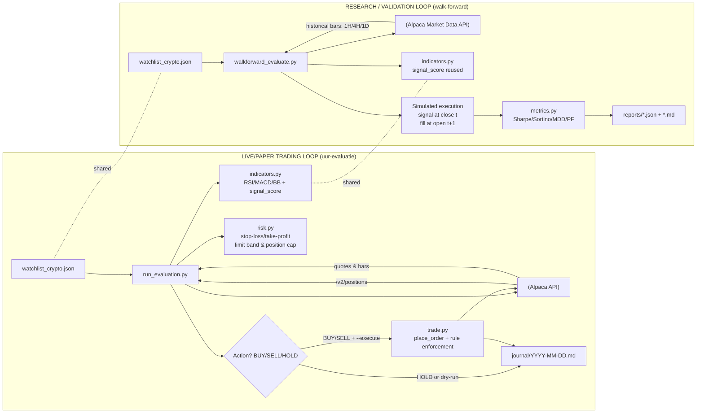

# Journal

One file per day, named `YYYY-MM-DD.md`, following `_template.md`.

The bot appends to the day's file at three points:
Please note: Github actions can skip cron jobs due to backend issues. Therefore we don't schedule the workflows on the whole hour or other peak times.

- Every hour at 23 minutes past the hour, trade evaluation block (via GitHub Actions)
- Every day at 23.21 Amsterdam time - daily reflection

Crypto trades 24/7, so a file is created every calendar day.

De repo is constructed as follows:

